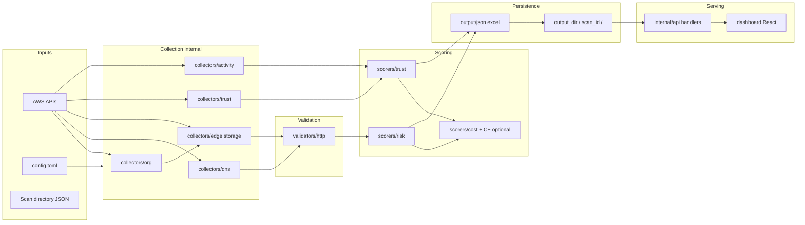
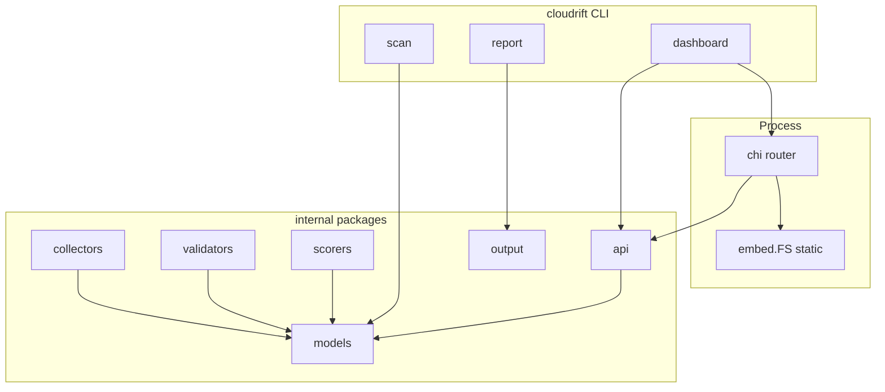

# Cloudrift — Technical Documentation

Complete reference for engineers onboarding to the repository. Assumptions and gaps between **library capabilities** and the **current CLI `scan` implementation** are called out explicitly.

---

## 1. Project overview

### Purpose

**Cloudrift** is a security and FinOps-oriented tool for AWS organizations. It focuses on:

- **Orphaned edge assets** — DNS names, CloudFront, S3 website endpoints, certificates, etc., with validation via DNS/HTTP probes and structured claimability (reclaimable, dangling, broken, edge obscured).
- **External IAM trust** — Roles that trust external principals (AWS accounts, SAML, OIDC), scored using IAM activity (`RoleLastUsed`) and configurable trust policy (approved accounts, stale/ghost day thresholds).
- **Cost signals** — Static per-asset estimates and optional **Cost Explorer** enrichment for orphaned-edge findings (not applied to `external_access` findings by design).
- **Reporting** — JSON artifacts, CLI table/JSON/CSV/markdown, Excel workbooks, and a **React dashboard** served by the same binary.

### Problem it solves

Teams lose track of DNS that points at deleted buckets, misconfigured distributions, or cross-account role trust that is stale or high-risk. Cloudrift produces **evidence-backed findings** and **estimated monthly cost / risk multipliers** so remediation can be prioritized.

### Key features (by subsystem)

| Area | Feature |
|------|---------|
| Collectors | Org accounts, DNS records, S3/CloudFront/edge assets, IAM trust policies, IAM role last-used activity |
| Validators | DNS resolution, HTTP/TLS probing, fingerprinting error bodies |
| Scorers | Risk/claimability (`orphaned_edge`), trust (`external_access`), static cost + optional CE merge |
| Output | JSON findings, CSV/markdown/table, Excel (findings + cost summary + trust sheet) |
| API | Read-only REST over scan directories; WebSocket stub for progress |
| Dashboard | Vite/React SPA embedded in Go; TanStack Query; light/dark theme (`darkMode: class`); Overview, Findings, Accounts, Diff, Trust report |
| Phase 3 graph | Optional Neo4j projection (`cloudrift scan --neo4j`), `cloudrift query` retrieval over projected vectors; JSON scan files remain source of truth |

---

## 2. Codebase structure

```
cloudrift/
├── cmd/cloudrift/          # CLI entry: Cobra commands, scan/report/dashboard wiring
├── dashboard/              # React app (src/), embeds dist/ via dashboard/embed.go
├── internal/
│   ├── api/                # HTTP router, handlers, JSON schema types
│   ├── aws/                # Session / credential helpers
│   ├── collectors/         # AWS + activity + trust collection
│   ├── config/             # TOML config load + defaults
│   ├── models/             # Finding, ScanSnapshot, AssetNode, Relationship
│   ├── output/             # excel, json, csv, markdown, table writers
│   ├── graph/              # Phase 3: Neo4j schema, writer, embedder, RAG retrieval
│   ├── scans/              # Scan directory layout, latest resolution, safe scan-id rules
│   ├── remediator/         # Remediation command generation (library)
│   ├── scorers/            # risk, trust, cost
│   └── validators/         # HTTP/DNS validation
├── docs/                   # Architecture notes, IAM setup, this file
├── iam/                    # StackSet / IAM artifacts for org-wide role
└── go.mod
```

### Entry points

- **CLI**: `cmd/cloudrift/main.go` — `main()` registers `scan`, `report`, `version`, `dashboard`, `query`.
- **HTTP**: `internal/api/server.go` — `NewRouter`, `StartServer`.
- **Embedded UI**: `dashboard/embed.go` exposes `embed.FS` of built assets; `cmd/cloudrift/dashboard.go` serves `fs.Sub(Dist, "dist")`.

### Important relationship: library vs CLI `scan`

The **`internal/`** packages implement a full pipeline (collectors → validators → scorers → output). **`runScan` in `cmd/cloudrift/main.go`** currently creates a scan directory with **empty `findings.json`** and metadata only. End-to-end scan orchestration in the CLI is a **documented gap**; tests and API/dashboard workflows assume **pre-populated** `findings.json` under `output_dir/<scan-id>/`.

---

## 3. API documentation

Base URL: same host as the dashboard (default `http://0.0.0.0:8080`). JSON only for REST. No authentication in-tree (local/controlled use assumed).

### Error envelope

`4xx`/`5xx` with body:

```json
{
  "error": "human message",
  "code": "machine_code",
  "details": { "optional": "map" }
}
```

### Scan ID resolution and path safety

**Single resolver:** `internal/scans.ResolveScanDirectoryName(outputDir, scanID)` is used by REST handlers (e.g. `internal/api/handlers/scans.go`) and by the CLI (`resolveScanID` in `cmd/cloudrift/main.go`, including `cloudrift query`). It ensures every join is `filepath.Join(outputDir, dirName)` where `dirName` passed `IsSafeScanID` after resolution.

**Rules:**

1. **Trim** leading/trailing ASCII space on the input token.
2. **`latest`** — Resolves to the directory name returned by `ResolveLatestScanID` (newest `scan-metadata.json` timestamp, descending; tie-break directory name ascending; malformed dirs skipped).
3. **Explicit ids** — Must satisfy `IsSafeScanID` (no `/`, `..`, or other path-segment tricks; allowlisted charset). Unsafe values return an error before any filesystem open.
4. **Neo4j export** — Uses only the **basename** of the resolved directory (never raw user path segments).

---

### GET `/api/scans`

**Purpose:** List scans from `output_dir` subdirectories whose names satisfy `IsSafeScanID` (same family of rules as `ResolveScanDirectoryName` for explicit ids).

**Inputs:** None.

**Outputs:** `ScanListResponse` — `items[]` with `scan_id`, `timestamp`, `account_ids`, counts, `total_monthly_cost_usd`; `total_items`.

**Ordering:** Newest `timestamp` first; tie-break `scan_id` ascending.

**Example:**

```http
GET /api/scans HTTP/1.1
```

```json
{
  "items": [
    {
      "scan_id": "20260418-120000",
      "timestamp": "2026-04-18T12:00:00Z",
      "account_ids": ["111111111111"],
      "finding_count": 42,
      "critical_count": 1,
      "high_count": 3,
      "total_monthly_cost_usd": 125.5
    }
  ],
  "total_items": 1
}
```

---

### GET `/api/scans/{id}/summary`

**Purpose:** Aggregate KPIs for one scan.

**Inputs:** Path `id` — scan directory name, or literal `latest`. **`latest`** resolves via `internal/scans.ResolveLatestScanID`: newest by `scan-metadata.json` **timestamp** (descending), tie-break **directory name ascending**; malformed scan dirs are skipped (same logic as `cloudrift report` / `cloudrift query`).

**Outputs:** `ScanSummaryResponse` — counts by severity (including residual `low_count`), claimability buckets, module counts (`external_access`, `orphaned_edge`), direct/risk USD totals.

**Example:**

```http
GET /api/scans/latest/summary HTTP/1.1
```

---

### GET `/api/scans/{id}/findings`

**Purpose:** Paginated, filterable findings list.

**Query parameters:**

| Param | Description |
|-------|-------------|
| `page` | Default `1` |
| `page_size` | Default `50`, max `200` |
| `severity` | e.g. `critical`, `high` |
| `module` | e.g. `orphaned_edge`, `external_access` |
| `account_id` | Filter by account |
| `claimability` | e.g. `reclaimable` |
| `search` | Case-insensitive substring on id, title, ARN, account, hostname, team |

**Outputs:** `FindingsListResponse` — `items`, `pagination`, `filters` echo.

**Ordering:** `affected_arn` asc, `id` tie-break.

**Example:**

```http
GET /api/scans/20260418-120000/findings?module=external_access&page=1&page_size=25 HTTP/1.1
```

---

### GET `/api/scans/{id}/findings/{fid}`

**Purpose:** Single finding with evidence, impact, recommendation, optional `trust` block for `external_access`.

**Inputs:** `fid` must match `^[a-zA-Z0-9._-]{1,128}$` (and not `.` / `..`).

**Outputs:** `FindingDetailResponse` → `item` with nested `FindingListItem` fields plus `evidence`, `trust`, etc.

**Example:**

```http
GET /api/scans/20260418-120000/findings/abc123def456 HTTP/1.1
```

---

### GET `/api/scans/{id}/accounts`

**Purpose:** Per-account rollup: finding counts, critical/high, direct/risk USD, top finding title.

**Outputs:** `AccountsBreakdownResponse`. Ordering: `account_id` ascending.

---

### GET `/api/diff`

**Purpose:** Compare two scans by finding identity.

**Query:** `old`, `new` — both validated scan ids (or `latest` where supported by handler).

**Identity:** `lower(trim(title)) + "|" + lower(trim(affected_arn))`.

**Outputs:** `DiffResponse` — `new_findings`, `resolved_findings`, `unchanged_count`.

**Example:**

```http
GET /api/diff?old=scan-a&new=scan-b HTTP/1.1
```

---

### GET `/api/scan/progress` (WebSocket)

**Purpose:** Placeholder progress stream (connect + one JSON event). **Not** tied to live scan execution in-process.

**Security:** Handshake allows origins `http(s)://localhost:*` and `http(s)://127.0.0.1:*` only.

**Example message:**

```json
{
  "event_type": "progress",
  "stage": "idle",
  "message": "scan progress stream is connected",
  "completed_accounts": 0,
  "total_accounts": 0,
  "timestamp": "2026-04-18T12:00:00Z"
}
```

---

## 4. Data flow (Mermaid)



*Solid lines reflect the **intended** pipeline. Today, the CLI `scan` command writes an empty findings file; populating `DIR` is assumed via future wiring or external generation.*

---

## 5. Architecture (Mermaid)



**Separation of concerns:**

- **collectors** — Talk to AWS; emit `AssetNode` + `Relationship`.
- **validators** — Interpret DNS/HTTP results; no AWS writes.
- **scorers** — Pure logic from models + validation + config; produce `Finding`.
- **api** — Read-only filesystem projection; no mutation of scans.
- **dashboard** — Presentation; `fetch('/api/...')`; theme preference in `localStorage` key `cloudrift-dashboard-theme` (see `dashboard/src/hooks/useTheme.tsx`).

---

## 6. Database / state

There is **no database** in core Phase 1–2 flow. **Phase 3** adds an **optional** Neo4j graph as a **read-side projection** of scan JSON (same `ResolveScanDirectoryName` rules apply when choosing what to export).

| Artifact | Path | Lifecycle |
|----------|------|-----------|
| Scan metadata | `output_dir/<scan_id>/scan-metadata.json` | Written per scan; drives list timestamps |
| Findings | `output_dir/<scan_id>/findings.json` | Source of truth for API and reports |
| Reports | `report.json`, `report.csv`, `report.md`, `.xlsx` | Optional exports |
| Neo4j graph | External DB (see `internal/graph/schema.go`) | Optional: `cloudrift scan --neo4j` after a scan dir exists; vectors + `ScanSnapshot` embedding identity for `cloudrift query` |

**Models:** `internal/models/finding.go` — severity, module (`orphaned_edge` | `external_access`), claimability, costs, evidence map, etc. `ScanSnapshot` holds scan-level metadata.

**Graph writer embedding fields:** `mergeScanSnapshotStatement` in `internal/graph/writer.go` only sets `embedding_provider` / `embedding_model` / `embedding_dimensions` on `:ScanSnapshot` when the scan has a **full** embedding identity including a **non-empty model** string, so Neo4j never stores half-written metadata that retrieval would reject.

---

## 7. Debugging strategy

### Failure points

1. **Empty or missing `findings.json`** — API returns 404/empty lists; dashboard shows empty states.
2. **Invalid JSON in scan dir** — `loadScanArtifacts` fails → 500 on API.
3. **Scan id path tricks** — Rejected by `scans.ResolveScanDirectoryName` / `IsSafeScanID` before `filepath.Join` (see [Scan ID resolution](#scan-id-resolution-and-path-safety)).
4. **AWS permission errors** — Collectors return errors; activity/trust partial failure modes depend on call site (first error wins in some concurrent collectors).
5. **CE enrichment** — `EnrichCostFromCE` logs `WARN` to stderr and **returns static costs** on failure (silent degradation).
6. **WebSocket** — Wrong origin → handshake failure; use loopback dashboard URL.

### Logging plan

- **CLI:** Standard output for `report` table; errors to stderr.
- **Cost:** `warnCE` in `internal/scorers/cost.go` for CE failures.
- **API:** No structured app logger; rely on `middleware.RequestID` + handler errors in JSON.

### Step-by-step debugging workflow

1. Confirm `output_dir` matches config and dashboard `--output-dir`.
2. Verify directory `output_dir/<scan_id>/` exists and `findings.json` unmarshals (`jq .` or `go run` small loader).
3. Curl API: `GET /api/scans`, then `GET /api/scans/<id>/summary`.
4. For trust rows, inspect `evidence` in JSON for `activity_status`, `verdict`, `admin_eval_state`.
5. For cost drift, grep stderr for `WARN:.*Cost Explorer`.
6. Run `go test ./...` after code changes.

### Observability

- **Metrics/tracing:** Not implemented; `RequestID` middleware only.
- **Future:** Structured logs, scan correlation id, Prometheus hooks (out of scope today).

---

## 8. Performance and scalability

| Bottleneck | Mitigation |
|------------|------------|
| IAM `ListRoles` + `GetRole` per role (activity/trust) | Concurrency semaphores in config (`role_assumption_concurrency`) |
| HTTP probes | `http_probe_concurrency`, timeouts |
| Large `findings.json` | API pagination + max `page_size` 200; full file read per request |
| Cost Explorer | Single `GetCostAndUsage` call; merged into map; distributed across findings sharing account+service |

**Scale limits:** Suited to org-scale **hundreds–low thousands** of findings per scan on a single host; no horizontal API tier.

---

## 9. Security review

| Topic | Status |
|-------|--------|
| Path traversal | Scan IDs resolved via `scans.ResolveScanDirectoryName` then `IsSafeScanID` before `filepath.Join`; static FS uses `embed.FS` + clean paths |
| Secrets in logs | Avoid logging raw credentials; CE warnings may include AWS error text — review in sensitive envs |
| OpenAI HTTP errors | `internal/graph/embedder.go` truncates HTTP error response bodies (`truncateForOperatorMessage`) so operator messages do not dump unbounded third-party payloads |
| API auth | None — bind to localhost or protect with network policy / reverse proxy |
| XSS (dashboard) | Evidence rendered as `JSON.stringify` in `<pre>` or text nodes; no `dangerouslySetInnerHTML` |
| WebSocket | Origin allowlist (loopback only) |
| Finding id | Bounded charset and length to reduce abuse |
| Neo4j embedding metadata | Writer only persists embedding columns when identity is complete (non-empty model); avoids incompatible partial rows |

---

## 10. Refactoring and enhancements

**Code quality / gaps**

- Wire **`runScan`** to collectors → validators → scorers → `writeFindings` (single orchestration module).
- **CLI `diff` / `remediate`:** README historically mentioned them; current Cobra tree omits them (`commands_test` still guards against accidental `diff` / `remediate`). **`query`** is registered for Phase 3 graph retrieval.
- **Neo4j (Phase 3 foundation):** `internal/graph` now contains optional schema + writer projection.
  It is isolated from Phase 1/2 execution paths and keeps JSON files as source of truth.
  Asset nodes use a single `:Asset` label with `asset_type` discriminator.
  Ownership can be projected from both `asset.account_id` (canonical) and `RelOwnedBy` rows
  targeting IAM root ARNs.
### Embeddings (Phase 3) — defaults and providers

**Default (explicit):** `config.Default()` sets **`embeddings.provider = "openai"`**. That is
documented in `internal/config/config.go` next to the `[embeddings]` struct. There is no hidden
default in tests — the same default applies at runtime when no TOML overrides exist.

**Only operational provider today:** **OpenAI** (`text-embedding-3-small`) via
`graph.NewEmbeddingProvider`, requesting **`dimensions: 384`** and `encoding_format: float` so
vectors match the Neo4j vector index (`finding_embeddings` in `internal/graph/schema.go`).
`Finding.Embedding` remains **`json:"-"`** (never written to flat JSON scan files).

**`local` is not supported:** it is a **planned** hook for future on-box **all-MiniLM-L6-v2**
(MiniLM/ONNX). Selecting `embeddings.provider = "local"` returns a stub whose **`Embed` always
fails** with `ErrLocalEmbeddingsUnavailable` until that implementation exists. Do not describe
`local` as a working provider in user-facing docs.

**Vector retrieval (Phase 3, `internal/graph/rag.go`):** `graph.RetrieveFindingContext` runs
`ValidateEmbeddingCompatibility` before any vector read, embeds the query with the caller’s
`EmbeddingProvider`, then runs hybrid Cypher (`HybridVectorRetrievalCypher`). JSON scan files remain
canonical; Neo4j is a projection only.

- **Operator UX (empty results):** Do not equate “zero hits” with “no relevant findings in the scan.”
  Inspect `RAGRetrievalResponse.EmptyHint` and `OperatorNotes`:
  - `RAGEmptyHintNoVectorCandidates` — the vector index returned no neighbors for this query at the
    current `vector_probe` (see `VectorProbe` on the response; it scales with `TopK` via
    `vectorProbeSize`).
  - `RAGEmptyHintNoHitsAfterScanScope` — global neighbors existed (`VectorGlobalMatchCount` > 0) but
    none matched `scan_id` via `CAPTURED` (or `LIMIT` removed rows). Suggest raising `TopK` (increases
    probe) or re-checking that this scan’s findings are embedded and exported.
- **Legacy scans:** `LegacyEmbeddingUnverified` when `ScanSnapshot` has no stored embedding identity;
  operator notes explain that compatibility was skipped.
- **Missing vector index (heuristic):** Use `errors.Is(err, graph.ErrRAGVectorIndexMissing)` or
  `graph.IsRAGVectorIndexMissing(err)`, then show `graph.RAGVectorIndexOperatorMessage` (stable text:
  apply `graph.SchemaStatements()`, re-export with embeddings). Do not rely on parsing raw Neo4j errors
  in UI.
- **Other retrieval failures:** Provider selection / `Embed` / dimension mismatch behave as in the
  embedding section above (`ErrOpenAIDimensionMismatch`, `ErrLocalEmbeddingsUnavailable`, etc.).

- **Tests** are strong in `internal/`; CLI integration test for full scan is thin.

### CLI `cloudrift query` (Phase 3)

- **Entry:** `cmd/cloudrift/query.go` — `newQueryCommand`, `runQueryCLI`, `runQueryRetrieval` (test seam with injectable `RowReader`).
- **Inputs:** Positional `QUERY_TEXT...` **or** `--query` (mutually exclusive). `--scan-id` (default `latest`), `--output-dir` (default `./cloudrift-output`), `--format` `table|json`, `--top-k`, `--require-stored-embedding-identity`.
- **Disk:** Reads **only** `scan-metadata.json` under the resolved scan directory for `scan_id` and embedding identity (does not substitute `findings.json` for retrieval).
- **Graph:** `graph.NewDriverRowReader` + `graph.RetrieveFindingContext` (compatibility validation always when identity is present).
- **Output:** Human `table` mode prints query, scan id, top-k, legacy vs verified embedding line, `vector_probe`, `vector_global_match_count`, probe saturation, `empty_hint` string (`RAGEmptyRetrievalHint.String()`), operator notes, per-hit grounding fields, and `Answer synthesis: not implemented`. JSON mode emits a single object (`answer_synthesis` always `""`).
- **Errors:** `queryRetrievalError` — missing index → `RAGVectorIndexOperatorMessage` + wrapped sentinel (`errors.Is` still works); other graph errors get short CLI prefixes without dumping raw Neo4j text as primary guidance.

**Suggested redesigns (non-blocking)**

- Extract `internal/pipeline` package for scan orchestration shared by CLI and future worker.
- Optional auth middleware for dashboard when bound beyond loopback.

---

## 11. Related docs

- [`architecture.md`](architecture.md) — Phase 1 file-backed summary
- [`getting-started.md`](getting-started.md), [`iam-setup.md`](iam-setup.md) — Operational setup

---

*Last updated: 2026-04-18 — aligns with Phase 3 graph/query, scan path safety, dashboard theming, and embedder error truncation.*
