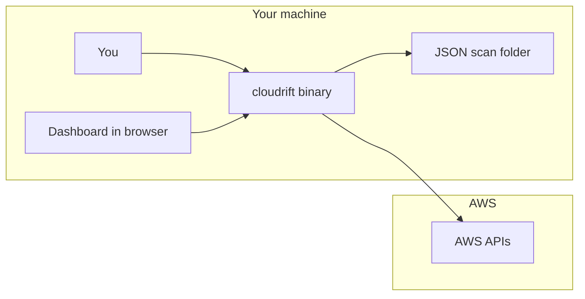
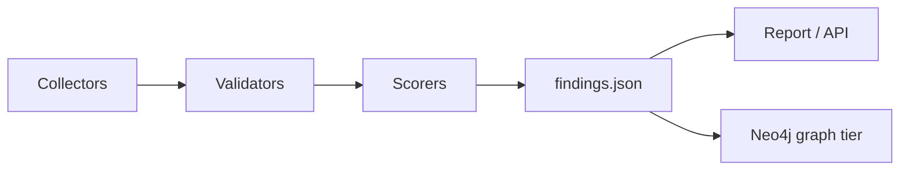
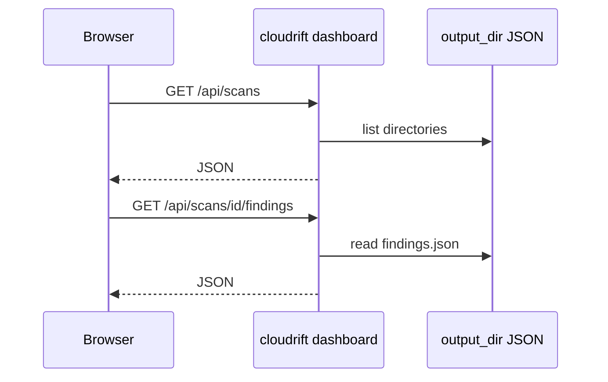

# Cloudrift Architecture

**Purpose of this file:** explain how the system fits together in **plain language**, where each part lives in the repo, and how data moves. For step-by-step setup, use [getting-started.md](getting-started.md). For API and embedding details, use [technical.md](technical.md). **Inline SVG diagrams** for beginners live in [starter-doc.html](../starter-doc.html).

---

## Mental model (beginner)

Think of three layers:

1. **Collect and score** (mostly in `internal/collectors`, `internal/validators`, `internal/scorers`) — library code that knows how to talk to AWS and how to grade risk.
2. **Write scans to disk** (`internal/scans`, `internal/scanrun`) — each run is a folder of JSON.
3. **Read scans** — the **CLI** (`report`, `query`), the **HTTP API** (`internal/api`), and the **embedded React app** read JSON files; **graph-tier** features also read **Neo4j** when configured.

The dashboard **never replaces** the JSON files as the long-term store of findings.

---

## Diagrams (textual)

### Beginner architecture

### Intended pipeline (library vs default CLI)

**Honesty box:** the default `cloudrift scan` command today stops short of populating `findings.json`. The boxes above reflect **intended** flow; use `cloudrift demo generate` or tests to exercise a populated `findings.json`.

### Dashboard data path

---

## Phase 1–2 (core)

The primary pipeline is **file-backed**:

1. Collect account/resource data.
2. Validate DNS/HTTP state.
3. Score claimability and cost.
4. Persist findings as JSON and render user reports (CLI `report` formats: table, JSON, CSV, markdown; dashboard). Excel workbook helpers exist under `internal/output/` for programmatic use but are **not** wired to the `cloudrift report` subcommand today.

Storage is intentionally flat-file JSON under `cloudrift-output/<scan-id>/`. Scan directory access uses shared rules in `internal/scans` (`ResolveScanDirectoryName`, `IsSafeScanID`, `latest` resolution).

**Current orchestration note:** the default CLI scan path (`cloudrift scan`) and dashboard Scan Control start path currently create scan metadata plus an empty `findings.json`. The collectors/scorers pipeline exists in `internal/` and is covered by tests, but full end-to-end wiring into the default scan command remains an explicit gap.

## Phase 3 (graph tier — Neo4j)

**Neo4j** is a **coupled graph tier**: `cloudrift scan --neo4j` (or `cloudrift demo generate --neo4j`) projects scan JSON into a graph database for **relationships**, **blast-radius**, **embeddings**, and **`cloudrift query`** (retrieval-only today; room for richer RAG-style investigation). **`findings.json` / `scan-metadata.json` remain the source of truth** on disk. **Main** dashboard/API workflows that only need JSON still run when Neo4j is absent.

Embeddings and hybrid retrieval live in `internal/graph`; operator-facing CLI entry is `cloudrift query`.

## Dashboard and API behavior

- Dashboard is served from the Go binary and uses left-rail primary navigation.
- `/overview` supports in-page product modes: `Executive Summary`, `High-Signal`, and `Operations` (`?view=...`).
- High-Signal is optimized for prioritized triage (top fixes + remediation groups); Operations is optimized for action flow (status, ownership risk, next actions).
- Dashboard mode is preserved while navigating within dashboard context; entering dashboard from other routes defaults to executive mode.
- `scan_id` remains URL-driven and is preserved through app navigation.
- Theme is token-driven (`darkMode: class`) with contrast-tuned helper text, table headers, borders, and focus-visible treatment shared across pages.

## Response-shape consistency

List-like API fields are intentionally normalized to stable arrays (`[]`) where practical rather than `null` (for example: scan/list `items`, diff lists, runtime profile lists, scan history items, and summary external-entity arrays). This reduces frontend null-ambiguity and runtime branching complexity.

For API routes, dashboard behavior (including light/dark theme), Mermaid diagrams, debugging, and security notes, see [technical.md](technical.md).

**Reviewer-oriented hub:** open [`starter-doc.html`](../starter-doc.html) at the repository root (single self-contained HTML; hash navigation).
