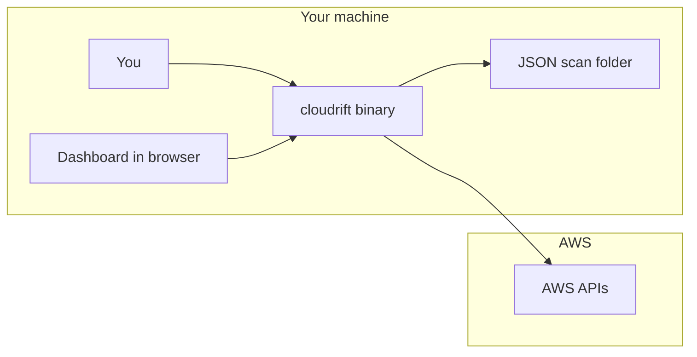
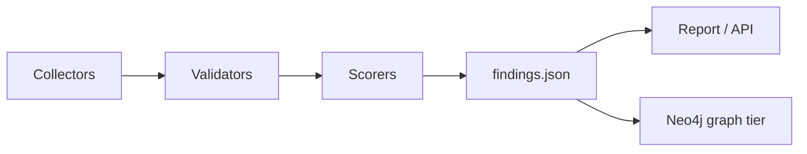
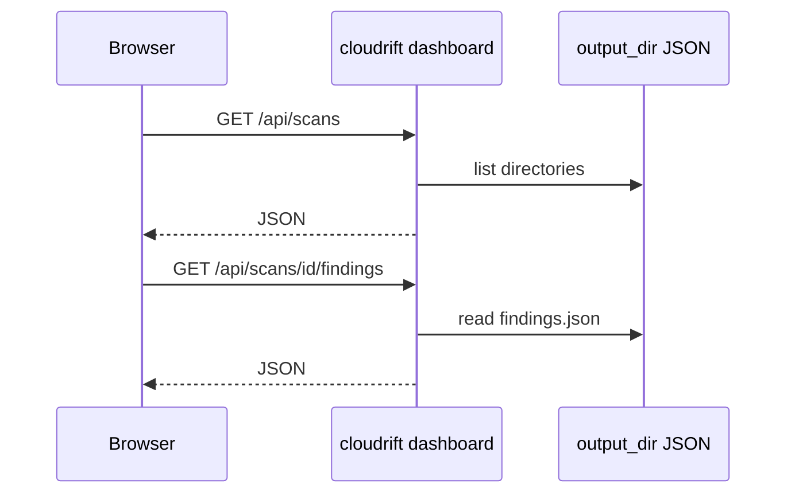

# Cloudrift Architecture

**Purpose of this file:** explain how the system fits together in **plain language**, where each part lives in the repo, and how data moves. For step-by-step setup, use [getting-started.md](getting-started.md). For API and embedding details, use [technical.md](technical.md). **Inline SVG diagrams** for beginners live in [starter-doc.html](../starter-doc.html).

---

## Mental model (beginner)

Think of three layers:

1. **Collect and score** (mostly in `internal/collectors`, `internal/validators`, `internal/scorers`) — library code that knows how to talk to AWS and how to grade risk.
2. **Orchestrate and write scans to disk** (`internal/pipeline`, `internal/scans`) — `internal/pipeline` wires collectors → validators → scorers into a single runnable scan; each run is a folder of JSON.
3. **Read scans** — the **CLI** (`report`, `query`), the **HTTP API** (`internal/api`), and the **embedded React app** read JSON files; **graph-tier** features also read **Neo4j** when configured.

The dashboard **never replaces** the JSON files as the long-term store of findings.

---

## Diagrams (textual)

### Beginner architecture

```mermaid
flowchart LR
  subgraph user_space [Your machine]
    U[You]
    B[cloudrift binary]
    J[JSON scan folder]
    D[Dashboard in browser]
  end
  subgraph aws [AWS]
    A[AWS APIs]
  end
  U --> B
  B --> A
  B --> J
  D --> B
```

### Detection pipeline (actual)

```mermaid
flowchart LR
  C[Collectors] --> V[Validators]
  V --> S[Scorers]
  S --> F[findings.json]
  F --> R[Report / API]
  F --> N[Neo4j graph tier]
```

This is the **actual** flow. `internal/pipeline` orchestrates it end to end (collect → assemble org-wide bucket-name set → validate → score → persist JSON), and both `cloudrift scan` and the dashboard Scan Control start path route through `pipeline.Run`. For an AWS-free walkthrough, `cloudrift demo generate` still synthesizes a populated `findings.json`.

### Dashboard data path

```mermaid
sequenceDiagram
  participant Browser
  participant Go as cloudrift dashboard
  participant Disk as output_dir JSON
  Browser->>Go: GET /api/scans
  Go->>Disk: list directories
  Go-->>Browser: JSON
  Browser->>Go: GET /api/scans/id/findings
  Go->>Disk: read findings.json
  Go-->>Browser: JSON
```

---

## Phase 1–2 (core)

The primary pipeline is **file-backed**:

1. Collect account/resource data.
2. Validate DNS/HTTP state.
3. Score claimability and cost.
4. Persist findings as JSON and render user reports (CLI `report` formats: table, JSON, CSV, markdown; dashboard). Excel workbook helpers exist under `internal/output/` for programmatic use but are **not** wired to the `cloudrift report` subcommand today.

Storage is intentionally flat-file JSON under `cloudrift-output/<scan-id>/`. Scan directory access uses shared rules in `internal/scans` (`ResolveScanDirectoryName`, `IsSafeScanID`, `latest` resolution).

**Orchestration (`internal/pipeline`):** the detection engine is wired end to end. `pipeline.Run` drives the full flow: collect (org accounts → per-account collectors for DNS, storage/S3, edge/CloudFront, trust/IAM, activity, and bucket policies) → assemble the org-wide bucket-name set → validate (DNS/HTTP probe, skippable) → score (`internal/scorers`: `ScoreRisk`, `ScoreTrust`, `ScoreResourceExposure`, `ScoreCost`, plus optional Cost Explorer enrichment) → persist `findings.json`, `scan-metadata.json`, `assets/assets.json`, and `relationships.json`. AWS collection sits behind a `Source` interface (`pipeline.NewAWSSource`) so the scoring/persistence stages stay testable without real AWS access. Both `cloudrift scan` (`cmd/cloudrift/main.go`) and the dashboard Scan Control start path (`internal/api/handlers/scan_control.go`) route through `pipeline.Run`; the older `internal/scanrun` stub has been removed.

**S3 resource-policy exposure:** cross-account / public S3 exposure is detected from resource-based bucket policies, as part of the **external_access** module. The collector `CollectBucketPolicies` (`internal/collectors/bucketpolicy.go`) reuses the already-listed buckets to read policies, and `ScoreResourceExposure` (`internal/scorers/resource_exposure.go`) grades the resulting cross-account/public grants.

**Scan coverage tracking:** collectors are resilient — a per-account failure (assume-role, bucket enumeration, or denied policy read) is recorded and skipped rather than failing the whole scan. `scan-metadata.json` now records `DiscoveredAccountCount`, `ScannedAccountCount`, `FailedAccountIDs`, and `CoverageComplete`. When coverage is incomplete, the pipeline downgrades absence-based critical orphaned-edge verdicts (a bucket could be owned by an unscanned account), annotating the finding with a coverage note.

## Phase 3 (graph tier — Neo4j)

**Neo4j** is a **coupled graph tier**: `cloudrift scan --neo4j` (or `cloudrift demo generate --neo4j`) projects scan JSON into a graph database for **relationships**, **blast-radius**, **embeddings**, and **`cloudrift query`** (embedding-backed hybrid retrieval, with **optional LLM answer synthesis** layered on top — see below). **`findings.json` / `scan-metadata.json` remain the source of truth** on disk. **Main** dashboard/API workflows that only need JSON still run when Neo4j is absent.

Embeddings and hybrid retrieval live in `internal/graph`; operator-facing CLI entry is `cloudrift query`.

**Optional RAG synthesis (`internal/synth`):** `cloudrift query` retrieves grounding findings, then — when a synthesis provider and API key are configured — asks an LLM to compose a grounded natural-language answer that cites the retrieved finding IDs. The `Synthesizer` interface is pluggable (Anthropic/Claude is the operational provider today). Without a configured provider/key it degrades to a no-op, preserving the prior retrieval-only behavior; synthesis never fails the query.

## Dashboard and API behavior

- Dashboard is served from the Go binary and uses left-rail primary navigation.
- `/overview` supports in-page product modes: `Executive Summary`, `High-Signal`, and `Operations` (`?view=...`).
- High-Signal is optimized for prioritized triage (top fixes + remediation groups); Operations is optimized for action flow (status, ownership risk, next actions).
- Dashboard mode is preserved while navigating within dashboard context; entering dashboard from other routes defaults to executive mode.
- `scan_id` remains URL-driven and is preserved through app navigation.
- When configured, the dashboard's Neo4j export (`exportScanToNeo4j` in `internal/api/handlers/scan_control.go`) projects **assets and relationships** alongside findings — yielding a traversable graph for blast-radius / attack paths rather than a findings-only graph — and attaches embeddings on export (best-effort, so the vector index is populated for query/RAG).
- Theme is token-driven (`darkMode: class`) with contrast-tuned helper text, table headers, borders, and focus-visible treatment shared across pages.

## Response-shape consistency

List-like API fields are intentionally normalized to stable arrays (`[]`) where practical rather than `null` (for example: scan/list `items`, diff lists, runtime profile lists, scan history items, and summary external-entity arrays). This reduces frontend null-ambiguity and runtime branching complexity.

For API routes, dashboard behavior (including light/dark theme), Mermaid diagrams, debugging, and security notes, see [technical.md](technical.md).

**Reviewer-oriented hub:** open [`starter-doc.html`](../starter-doc.html) at the repository root (single self-contained HTML; hash navigation).
