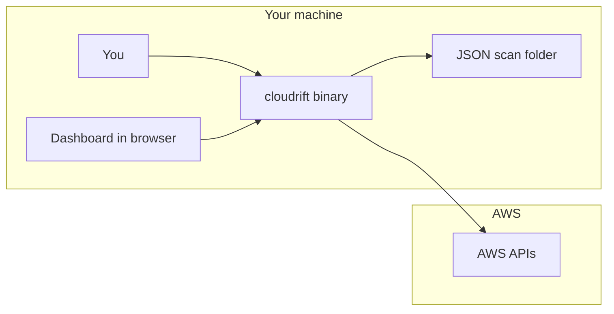
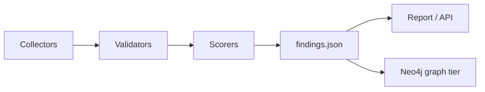
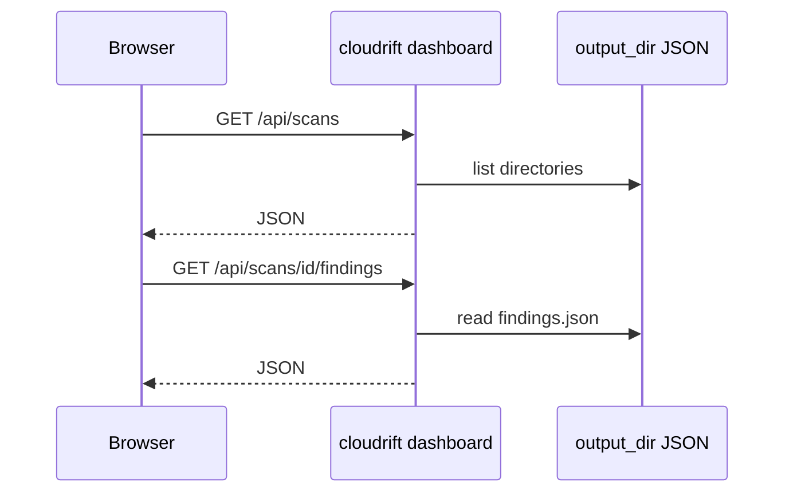
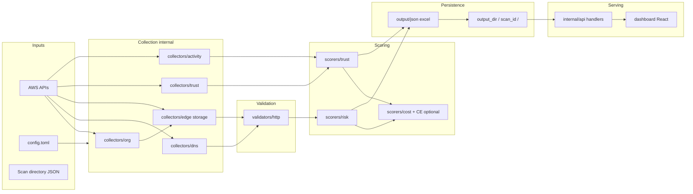
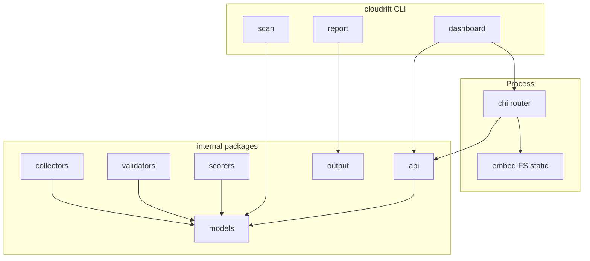

# Cloudrift — Documentation

Cloudrift is a CLI and embedded dashboard for discovering orphaned AWS edge assets (DNS, S3 websites, CloudFront) and risky cross-account IAM trust relationships. It scans your AWS organization, writes findings as local JSON (no database required), and provides evidence-backed severity scoring. This document consolidates the project's overview, setup, architecture, command reference, configuration, security coverage, IAM deployment, technical/API reference, and contribution guidelines into a single source.

<!-- audience-map
overview: operator, security, developer
getting-started: operator, developer
architecture: security, developer
cli-commands: operator, developer
configuration: operator, developer
security-coverage: security
iam-setup: operator
api-technical-reference: developer
contributing: developer
-->

## Table of Contents

- [Overview](#overview)
- [Getting Started](#getting-started)
- [Architecture](#architecture)
- [CLI Commands](#cli-commands)
- [Configuration](#configuration)
- [Security Coverage](#security-coverage)
- [IAM Setup](#iam-setup)
- [API & Technical Reference](#api--technical-reference)
- [Contributing](#contributing)

---

## Overview

Cloudrift is a CLI and embedded dashboard for discovering orphaned AWS edge assets (DNS, S3 websites, CloudFront) and risky cross-account IAM trust relationships. It scans your AWS organization, writes findings as local JSON (no database required), and provides evidence-backed severity scoring.

**Key points:**
- Calls AWS APIs to inventory edge, IAM-trust, and S3 resource-policy exposure across your org
- Writes findings to local JSON per scan — read via dashboard, CLI reports, or your own tooling
- Dashboard provides interactive exploration and a scan control center
- `cloudrift demo generate` populates the UI with sample data (no AWS needed)
- Neo4j is optional for advanced graph features (blast-radius, vector search, `cloudrift query`)

### What it solves

- **Orphaned edge:** DNS hostnames that resolve but point to deleted/misconfigured S3 buckets, CloudFront origins, or ELBs — with a verdict (reclaimable, dangling, etc.)
- **External trust:** IAM roles trusting external AWS accounts or principals, scored by last-used date, admin privileges, and risk profile
- **Resource-policy exposure:** S3 bucket policies granting cross-account or public access — exposure that IAM role-trust scanning misses
- **Visibility:** Self-hosted dashboard and CLI reports over the same HTTP server — no cloud dependency

### Current implementation status

| Feature | Status | Notes |
| --- | --- | --- |
| `cloudrift scan` | Complete | Runs the full pipeline: collects org accounts, per-account inventory (DNS/Route53, S3, CloudFront, IAM trust, role activity, S3 bucket policies), validates DNS/HTTP, scores, and persists findings as JSON |
| `cloudrift demo generate` | Complete | Deterministic populated scan for learning the UI |
| Dashboard + REST API | Complete | Works from JSON on disk; Neo4j optional |
| `cloudrift report` | Complete | Export findings as table, JSON, CSV, markdown, Excel, or SARIF |
| `cloudrift query` | Complete | Vector search over Neo4j; optional LLM answer synthesis when a synthesis provider is configured |
| Neo4j integration | Optional | Adds blast-radius explorer, graph relationships, vector index |
| Local embeddings | Stub | `provider=local` will error until implemented |

**Try immediately (no AWS):** `cloudrift demo generate && cloudrift dashboard --open`. A live scan (`cloudrift scan`) runs against a real AWS organization with credentials configured.

### Installation

#### Option 1 - Pre-built binary (recommended)

Download the latest release for your platform:

```bash
# Linux / macOS (example for linux_amd64)
curl -sSL https://github.com/Zero0x00/cloudrift/releases/latest/download/cloudrift_Linux_x86_64.tar.gz | tar -xz
sudo mv cloudrift /usr/local/bin/
cloudrift version
```

Verify the checksum:

```bash
sha256sum -c checksums.txt --ignore-missing
```

#### Option 2 - `go install`

Requires Go 1.24+. The pre-built dashboard UI is committed to the repo (`dashboard/dist`) and embedded into the binary, so `go install` and a plain `go build` produce a working UI without an npm step.

```bash
go install github.com/Zero0x00/cloudrift/cmd/cloudrift@latest
cloudrift version
```

#### Option 3 - Build from source

Requires Go 1.24+ (Node.js 20+ only if you want to rebuild the UI from source):

```bash
git clone https://github.com/Zero0x00/cloudrift.git
cd cloudrift
make build
sudo mv cloudrift /usr/local/bin/
cloudrift version
```

For a step-by-step build-from-source walkthrough, see [Getting Started](#getting-started).

### Requirements

#### AWS

- **AWS credentials** for the management account (or delegated audit role) that can assume org member roles
- See [IAM Setup](#iam-setup) for org setup and StackSet deployment

#### Optional

- **Neo4j 5+** — for blast-radius exploration, relationship graphs, and vector search (`cloudrift query`). The dashboard and core workflows degrade cleanly without it (JSON-only mode).

#### Build-time only

- Go 1.24+ and Node.js 20+ (to build from source; not needed for pre-built binaries)

### AWS credential selection

**Dashboard:** Exposes a profile picker on the Scan Control page.

**CLI:** Does not have a `--profile` flag. Credentials come from (in order):

1. `[aws].management_profile` in `cloudrift.toml` (default: `"default"`)
2. `AWS_PROFILE` environment variable (if `management_profile` is empty)
3. AWS default profile chain (env vars, SSO, instance role, etc.)

### Build commands

```bash
make build    # Rebuild the dashboard UI from source, then compile (requires npm + go)
make dev      # Compile only, no npm step (embeds the committed dashboard/dist UI)
make test     # Run all tests
```

The version string comes from the latest git tag. Tagged releases (e.g. `v0.2.0`) are injected; untagged builds show `dev`.

### Dashboard UI

Start the dashboard:

```bash
cloudrift dashboard --port 8080 --open
```

Open `http://127.0.0.1:8080` in your browser (or use `?scan_id=<id>` to load a specific scan).

For the full `dashboard` flag reference, see [CLI Commands](#cli-commands). For bind/auth security details, see [Configuration](#configuration) and the [API & Technical Reference](#api--technical-reference) security review.

| Page | Purpose |
| --- | --- |
| Overview | Summary, high-signal findings, operations view |
| Scan Control | Start scans, validate AWS profile, runtime status |
| Findings | Paginated findings table with filters and sorting |
| Triage | Findings in triage/review mode |
| Accounts | Per-account risk breakdown |
| Diff | Compare two scans side-by-side |
| Trust Report | IAM trust findings, external principals |
| External Entities | Entity-centric view with blast actions |
| Blast Explorer | 3D graph visualization of risk paths (Neo4j required) |
| Alerting | Slack webhooks, alert rules, event history |

Light and dark themes available; preference stored in browser localStorage.

### Neo4j (optional graph tier)

#### Setup

1. Run Neo4j 5+ with Bolt accessible from your machine
2. Create a database user and add to `cloudrift.toml` (see the `[neo4j]` settings in [Configuration](#configuration))
3. Export a scan: `cloudrift scan --neo4j` or `cloudrift demo generate --neo4j --dense`

#### Local Docker setup

```bash
export CLOUDRIFT_NEO4J_PASSWORD='dev-password-only'
docker run --name cloudrift-neo4j -p 7474:7474 -p 7687:7687 \
  -e NEO4J_AUTH=neo4j/${CLOUDRIFT_NEO4J_PASSWORD} \
  -d neo4j:5
```

#### Example queries

```cypher
MATCH (s:ScanSnapshot) RETURN s.scan_id, s.finding_count LIMIT 25;
MATCH (f:Finding) WHERE f.scan_id = $scan RETURN f.id, f.title, f.severity LIMIT 50;
```

#### Graceful degradation

Neo4j is optional. When unconfigured or unreachable, the dashboard and API still work with JSON-only findings (no blast-radius explorer or vector search).

### Scan output structure

```
cloudrift-output/
└── <scan-id>/
    ├── scan-metadata.json
    ├── findings.json
    ├── relationships.json    (optional)
    └── assets/               (optional)
        └── *.json
```

`scan-metadata.json` also records scan coverage: discovered/scanned account counts, the IDs of accounts that failed to scan, and a `coverage_complete` flag. Incomplete coverage downgrades absence-based verdicts (e.g. "reclaimable" orphaned-edge findings) since a bucket may be owned by an unscanned account.

Latest scan resolves by timestamp in `scan-metadata.json` (newest first); directory name used as tiebreak.

### Org setup

For multi-account scanning, set up an audit role via CloudFormation StackSet. See [IAM Setup](#iam-setup) and `iam/stackset-template.yaml`.

### Version and license

Current version: injected from git tag (`git describe`). See `tech-spec-v2.md` for historical context and design notes.

---

## Getting Started

This guide is for someone who can open a terminal but may not know AWS Organizations, Neo4j, or embeddings. For a **clickable walkthrough** with diagrams, open [starter-doc.html](../starter-doc.html) in your browser. For a command cheat sheet, see [CLI Commands](#cli-commands).

### 1. Prerequisites

| Tool | Why | Required? |
| --- | --- | --- |
| **Go 1.24+** | Build `cloudrift` from source | Yes for `go build` / `make build` |
| **Node.js 20+ and npm** | Build the embedded dashboard before `go build` | Yes for full UI in dev builds; release binaries already embed UI |
| **AWS credentials** | **Real scans** call the AWS SDK to discover, probe, and score org assets — production value is AWS-backed | Required for live assessment; **not** needed for `demo generate` alone |
| **AWS CLI** | Helps verify credentials (`aws sts get-caller-identity`); also used to refresh an expired SSO session | Recommended |
| **Neo4j 5+** | **Graph tier** — relationships, blast-radius, embeddings, `cloudrift query` | Only if you use that tier |
| **OpenAI API key** | Default embedding provider for **graph-tier** `query` when Neo4j is used | Optional, only for that path |
| **Anthropic API key** | Optional LLM answer synthesis on top of `cloudrift query` retrieval | Optional, only for synthesized answers |

Environment variables are documented in the [Configuration](#configuration) section.

### 2. Clone and build from source

```bash
git clone https://github.com/Zero0x00/cloudrift.git
cd cloudrift
go mod download
go test ./...
```

Build the dashboard static assets, then the Go binary:

```bash
cd dashboard
npm ci
npm run build
cd ..
go build -o cloudrift ./cmd/cloudrift
```

Or use the Makefile (same outcome):

```bash
make build
```

Verify:

```bash
./cloudrift version
```

### 3. Try locally without AWS (demo UI path)

**Why this exists:** `cloudrift demo generate` writes **deterministic** `findings.json` (and related files) so you can explore the **dashboard and reports** without calling AWS APIs for inventory. It does **not** replace a real org scan — live data comes from a real `cloudrift scan` against your AWS org (see section 5).

```bash
./cloudrift demo generate --output-dir ./cloudrift-output
./cloudrift report --scan-id latest --format table
./cloudrift dashboard --output-dir ./cloudrift-output --port 8080 --open
```

Open `http://127.0.0.1:8080` and pick the newest scan from the list, or open `?scan_id=demo` if you generated with `--scan-id demo`.

The repo may ship sample data under `cloudrift-output/demo/`; you can regenerate with:

```bash
./cloudrift demo generate --output-dir ./cloudrift-output --scan-id demo --timestamp 2026-04-18T18:00:00Z
```

### 4. Run with AWS credentials

Cloudrift uses the **AWS SDK default credential chain** unless you pin a profile name in config.

#### Environment variables (example)

```bash
export AWS_ACCESS_KEY_ID=...
export AWS_SECRET_ACCESS_KEY=...
export AWS_REGION=us-east-1
```

#### Named profile via TOML (not a CLI flag)

There is **no** `--profile` flag on `cloudrift` commands. Set the profile in `cloudrift.toml`:

```toml
[aws]
management_profile = "my-readonly-profile"
```

If `management_profile` is **empty**, the SDK uses the default chain (which includes `AWS_PROFILE` when you export it, same as other AWS tools).

#### Config file location

Search order: path in `CLOUDRIFT_CONFIG`, else `./cloudrift.toml` next to where you run the binary. See [Configuration](#configuration) for the full file reference.

### 5. Run a real scan

```bash
./cloudrift scan --output-dir ./cloudrift-output
```

**Credentials:** this command **checks AWS** (`ensureValidSession`) before doing any work. If your SSO session has expired, it attempts `aws sso login` and retries; if the AWS CLI isn't installed, it prints the manual login command.

**What you get:** a timestamped directory with `scan-metadata.json`, `findings.json` (real discovered + scored findings), per-collector files under `assets/`, and `relationships.json`. The pipeline collects org inventory, probes edge assets over HTTP, and scores them.

**Useful flags:**

```bash
./cloudrift scan --no-http              # skip HTTP probing
./cloudrift scan --concurrency 100      # HTTP probe concurrency (default 50)
```

**Graph tier export** (writes the scan, then projects it into Neo4j):

```bash
./cloudrift scan --output-dir ./cloudrift-output --neo4j
```

Requires `[neo4j]` in TOML and the password env var it references (default `CLOUDRIFT_NEO4J_PASSWORD`). See the full flag reference under [CLI Commands](#cli-commands).

### 6. Open the dashboard

```bash
./cloudrift dashboard --output-dir ./cloudrift-output --port 8080 --open
```

The dashboard binds **`127.0.0.1` by default**. To expose it on the network, pass `--host 0.0.0.0`; the command warns you to set auth first. Setting `CLOUDRIFT_API_TOKEN` gates the whole server (API + UI) behind HTTP Basic auth — the token is the password (username is ignored):

```bash
CLOUDRIFT_API_TOKEN=s3cr3t ./cloudrift dashboard --host 0.0.0.0
```

The dashboard **runs fully from JSON** for core pages (listings, findings, diff, trust). **Graph-tier** views (blast explorer, vector query UI) need Neo4j + export; APIs return `graph_available: false` when the graph tier is off.

Overview has three modes (Executive Summary, High-Signal, Operations) via URL state, e.g. `?view=high-signal`. Theme preference is stored in `localStorage` as `cloudrift-dashboard-theme`.

### 7. Reports (CLI)

Supported formats: **`table`**, **`json`**, **`csv`**, **`markdown`**, **`excel`** (`.xlsx`), **`sarif`** (SARIF 2.1.0, for GitHub code scanning). `table` prints to stdout; the others write a file — to `--output` if given, otherwise `<scan-dir>/report.<ext>`.

```bash
./cloudrift report --scan-id latest --format markdown --output ./report.md
./cloudrift report --format excel       # writes <scan-dir>/report.xlsx
./cloudrift report --format sarif        # writes <scan-dir>/report.sarif
```

### 8. Neo4j (graph tier)

Neo4j is **coupled** to advanced product behavior: **relationship graph**, **blast-radius** exploration, **embeddings**, **`cloudrift query`**, and headroom for **future RAG-style** workflows. **Main** operator flows still work with JSON files only.

1. Run Neo4j 5+ with Bolt reachable (Docker example in the [Overview](#overview) Neo4j section).
2. Add `[neo4j]` to `cloudrift.toml` (`uri`, `username`, `password_env`) — see [Configuration](#configuration).
3. Run `cloudrift scan --neo4j` or `cloudrift demo generate --neo4j`.

JSON files on disk remain the **source of truth**; Neo4j is a projection.

### 9. `cloudrift query` (graph tier)

Hybrid retrieval over embedded finding text in Neo4j, with **optional** LLM answer synthesis grounded in the retrieved findings.

- Default embeddings: OpenAI `text-embedding-3-small` — set `OPENAI_API_KEY` (or the env name in `[embeddings].openai_api_key_env`).
- **`provider=local` is stubbed** and returns an error until a local model ships.
- **Answer synthesis** is enabled when a synthesis provider API key is configured (`[synthesis]` in TOML; default provider Anthropic, key from `ANTHROPIC_API_KEY`). The retrieved findings are passed to the LLM to compose a grounded answer that cites finding IDs. Without a key, output is **retrieval-only**.
- Output `--format` is `table` (human summary) or `json`. `--top-k` defaults to 10 (max 100).

Example:

```bash
./cloudrift query "show high severity external trust" --scan-id latest --output-dir ./cloudrift-output
```

### 10. Troubleshooting

| Symptom | Likely cause | What to try |
| --- | --- | --- |
| `NoCredentialProviders` / auth errors | No credentials in chain | Run `aws sts get-caller-identity` with same profile/env |
| `AccessDenied` on `AssumeRole` | Trust policy, external ID, or role name | Compare member account role to `iam/stackset-template.yaml` |
| Dashboard empty | Empty `findings.json` | Pick a scan that has findings, or run `demo generate` |
| Dashboard returns 401 | `CLOUDRIFT_API_TOKEN` is set | Provide the token as the Basic-auth password, or unset the env var |
| Neo4j errors | Wrong URI, auth, or firewall | Check `bolt://` host, `password_env`, Docker port 7687 |
| Query / embedding errors | Missing OpenAI key | Set `OPENAI_API_KEY` or skip `query` |
| Query returns hits but no narrative answer | No synthesis key | Set `ANTHROPIC_API_KEY` (or `[synthesis].api_key_env`) to enable LLM answers |
| `provider=local` fails | Stub | Use `openai` or omit query |
| `npm run build` fails | Missing deps | `cd dashboard && npm ci` |

Further detail: [API & Technical Reference](#api--technical-reference), [Architecture](#architecture), [IAM Setup](#iam-setup).

---

## Architecture

**Purpose of this section:** explain how the system fits together in **plain language**, where each part lives in the repo, and how data moves. For step-by-step setup, use [Getting Started](#getting-started). For API and embedding details, use the [API & Technical Reference](#api--technical-reference). **Inline SVG diagrams** for beginners live in [starter-doc.html](../starter-doc.html).

### Mental model (beginner)

Think of three layers:

1. **Collect and score** (mostly in `internal/collectors`, `internal/validators`, `internal/scorers`) — library code that knows how to talk to AWS and how to grade risk.
2. **Orchestrate and write scans to disk** (`internal/pipeline`, `internal/scans`) — `internal/pipeline` wires collectors → validators → scorers into a single runnable scan; each run is a folder of JSON.
3. **Read scans** — the **CLI** (`report`, `query`), the **HTTP API** (`internal/api`), and the **embedded React app** read JSON files; **graph-tier** features also read **Neo4j** when configured.

The dashboard **never replaces** the JSON files as the long-term store of findings.

### Diagrams (textual)

#### Beginner architecture



#### Detection pipeline (actual)



This is the **actual** flow. `internal/pipeline` orchestrates it end to end (collect → assemble org-wide bucket-name set → validate → score → persist JSON), and both `cloudrift scan` and the dashboard Scan Control start path route through `pipeline.Run`. For an AWS-free walkthrough, `cloudrift demo generate` still synthesizes a populated `findings.json`.

#### Dashboard data path



### Phase 1–2 (core)

The primary pipeline is **file-backed**:

1. Collect account/resource data.
2. Validate DNS/HTTP state.
3. Score claimability and cost.
4. Persist findings as JSON and render user reports (CLI `report` formats: table, JSON, CSV, markdown; dashboard). Excel workbook helpers exist under `internal/output/` for programmatic use but are **not** wired to the `cloudrift report` subcommand today.

Storage is intentionally flat-file JSON under `cloudrift-output/<scan-id>/`. Scan directory access uses shared rules in `internal/scans` (`ResolveScanDirectoryName`, `IsSafeScanID`, `latest` resolution).

**Orchestration (`internal/pipeline`):** the detection engine is wired end to end. `pipeline.Run` drives the full flow: collect (org accounts → per-account collectors for DNS, storage/S3, edge/CloudFront, trust/IAM, activity, and bucket policies) → assemble the org-wide bucket-name set → validate (DNS/HTTP probe, skippable) → score (`internal/scorers`: `ScoreRisk`, `ScoreTrust`, `ScoreResourceExposure`, `ScoreCost`, plus optional Cost Explorer enrichment) → persist `findings.json`, `scan-metadata.json`, `assets/assets.json`, and `relationships.json`. AWS collection sits behind a `Source` interface (`pipeline.NewAWSSource`) so the scoring/persistence stages stay testable without real AWS access. Both `cloudrift scan` (`cmd/cloudrift/main.go`) and the dashboard Scan Control start path (`internal/api/handlers/scan_control.go`) route through `pipeline.Run`; the older `internal/scanrun` stub has been removed.

**S3 resource-policy exposure:** cross-account / public S3 exposure is detected from resource-based bucket policies, as part of the **external_access** module. The collector `CollectBucketPolicies` (`internal/collectors/bucketpolicy.go`) reuses the already-listed buckets to read policies, and `ScoreResourceExposure` (`internal/scorers/resource_exposure.go`) grades the resulting cross-account/public grants.

**Scan coverage tracking:** collectors are resilient — a per-account failure (assume-role, bucket enumeration, or denied policy read) is recorded and skipped rather than failing the whole scan. `scan-metadata.json` now records `DiscoveredAccountCount`, `ScannedAccountCount`, `FailedAccountIDs`, and `CoverageComplete`. When coverage is incomplete, the pipeline downgrades absence-based critical orphaned-edge verdicts (a bucket could be owned by an unscanned account), annotating the finding with a coverage note.

### Phase 3 (graph tier — Neo4j)

**Neo4j** is a **coupled graph tier**: `cloudrift scan --neo4j` (or `cloudrift demo generate --neo4j`) projects scan JSON into a graph database for **relationships**, **blast-radius**, **embeddings**, and **`cloudrift query`** (embedding-backed hybrid retrieval, with **optional LLM answer synthesis** layered on top — see below). **`findings.json` / `scan-metadata.json` remain the source of truth** on disk. **Main** dashboard/API workflows that only need JSON still run when Neo4j is absent.

Embeddings and hybrid retrieval live in `internal/graph`; operator-facing CLI entry is `cloudrift query`.

**Optional RAG synthesis (`internal/synth`):** `cloudrift query` retrieves grounding findings, then — when a synthesis provider and API key are configured — asks an LLM to compose a grounded natural-language answer that cites the retrieved finding IDs. The `Synthesizer` interface is pluggable (Anthropic/Claude is the operational provider today). Without a configured provider/key it degrades to a no-op, preserving the prior retrieval-only behavior; synthesis never fails the query.

### Dashboard and API behavior

- Dashboard is served from the Go binary and uses left-rail primary navigation.
- `/overview` supports in-page product modes: `Executive Summary`, `High-Signal`, and `Operations` (`?view=...`).
- High-Signal is optimized for prioritized triage (top fixes + remediation groups); Operations is optimized for action flow (status, ownership risk, next actions).
- Dashboard mode is preserved while navigating within dashboard context; entering dashboard from other routes defaults to executive mode.
- `scan_id` remains URL-driven and is preserved through app navigation.
- When configured, the dashboard's Neo4j export (`exportScanToNeo4j` in `internal/api/handlers/scan_control.go`) projects **assets and relationships** alongside findings — yielding a traversable graph for blast-radius / attack paths rather than a findings-only graph — and attaches embeddings on export (best-effort, so the vector index is populated for query/RAG).
- Theme is token-driven (`darkMode: class`) with contrast-tuned helper text, table headers, borders, and focus-visible treatment shared across pages.

### Response-shape consistency

List-like API fields are intentionally normalized to stable arrays (`[]`) where practical rather than `null` (for example: scan/list `items`, diff lists, runtime profile lists, scan history items, and summary external-entity arrays). This reduces frontend null-ambiguity and runtime branching complexity.

For API routes, dashboard behavior (including light/dark theme), Mermaid diagrams, debugging, and security notes, see the [API & Technical Reference](#api--technical-reference).

**Reviewer-oriented hub:** open [`starter-doc.html`](../starter-doc.html) at the repository root (single self-contained HTML; hash navigation).

---

## CLI Commands

Reference for each `cloudrift` subcommand. This is the canonical command and flag reference for the project.

**Global flag:** `--config <path>` — path to `cloudrift.toml` (optional). When unset, the binary searches `CLOUDRIFT_CONFIG`, then `./cloudrift.toml`.

| Command | What it does |
| --- | --- |
| **`cloudrift scan`** | Validates AWS credentials, then runs real discovery + scoring against the org and writes `output_dir/<scan-id>/` (`scan-metadata.json`, `findings.json`, `assets/`, `relationships.json`). |
| **`cloudrift demo generate`** | Writes a **deterministic** populated scan (findings, relationships, assets) for UI and report demos — does **not** call live AWS collectors. |
| **`cloudrift report`** | Reads `findings.json` for a scan and renders it as table, json, csv, markdown, excel, or sarif. |
| **`cloudrift dashboard`** | Serves the embedded SPA + REST API over scans under `output_dir`. |
| **`cloudrift query`** | Vector retrieval over the Neo4j projection, with optional LLM answer synthesis grounded in the retrieved findings. |
| **`cloudrift version`** | Prints the build version. |

### `cloudrift scan`

Runs the full pipeline: AWS credential check (`ensureValidSession`, which can auto-trigger `aws sso login` on an expired SSO session) → collect inventory → score → write findings.

| Flag | Default | Description |
| --- | --- | --- |
| `--output-dir` | config `output_dir` (`./cloudrift-output`) | Directory for `<scan-id>/` output. |
| `--no-http` | `false` | Skip HTTP probing during discovery (honored). |
| `--concurrency` | `50` | HTTP probe concurrency (honored — overrides `scan.http_probe_concurrency`). |
| `--neo4j` | `false` | After writing scan files, export the projection to Neo4j (requires `[neo4j]` config + the referenced password env var). |

```bash
cloudrift scan --output-dir ./cloudrift-output
cloudrift scan --no-http --concurrency 100
cloudrift scan --neo4j
```

### `cloudrift demo generate`

Subcommand of `cloudrift demo`. Writes a deterministic 5-account demo dataset without any AWS access.

| Flag | Default | Description |
| --- | --- | --- |
| `--output-dir` | config `output_dir` (`./cloudrift-output`) | Output directory. |
| `--scan-id` | `demo-<UTC timestamp>` | Fixed scan directory name (must satisfy safe-scan-id rules). |
| `--neo4j` | `false` | Export the generated demo projection to Neo4j. |
| `--dense` | `false` | Add deterministic dense cross-account trust chains for richer blast-radius paths. |

```bash
cloudrift demo generate --output-dir ./cloudrift-output
cloudrift demo generate --scan-id demo --dense
```

### `cloudrift report`

Loads `findings.json` for the resolved scan and renders it. `table` prints to stdout; every other format writes a file (to `--output` if set, else `<scan-dir>/report.<ext>`).

| Flag | Default | Description |
| --- | --- | --- |
| `--scan-id` | `latest` | Scan ID, or `latest` (newest by `scan-metadata.json` timestamp; tie-break directory name ascending). |
| `--format` | `table` | `table` \| `json` \| `csv` \| `markdown` \| `excel` \| `sarif` (`xlsx` is accepted as an alias for `excel`). |
| `--output` | — | Explicit output path; overrides the default `<scan-dir>/report.<ext>`. |
| `--output-dir` | `./cloudrift-output` | Directory containing scan subfolders. |

- `excel` → `.xlsx` workbook.
- `sarif` → SARIF 2.1.0, suitable for GitHub code scanning.

```bash
cloudrift report --scan-id latest --format table
cloudrift report --format markdown --output ./report.md
cloudrift report --format sarif
```

### `cloudrift dashboard`

Serves the embedded SPA and REST API. Binds loopback (`127.0.0.1`) by default; pass `--host` to expose it on the network. Set `CLOUDRIFT_API_TOKEN` to gate the whole server (API + UI) behind HTTP Basic auth (the token is the password; username is ignored). See [Configuration](#configuration) for the serving/security model.

| Flag | Default | Description |
| --- | --- | --- |
| `--port` | `8080` | HTTP listen port (1–65535). |
| `--host` | `127.0.0.1` | Bind address. Set to `0.0.0.0` to expose on the network — prints a warning unless `CLOUDRIFT_API_TOKEN` is set. |
| `--open` | `false` | Open the dashboard in the default browser after startup (loopback URLs only). |
| `--scan-id` | — | Optional default scan id, appended to the browser-open URL as a `scan_id` query param. |
| `--output-dir` | config `output_dir` (`./cloudrift-output`) | Directory containing scan output. |

```bash
cloudrift dashboard --output-dir ./cloudrift-output --port 8080 --open
CLOUDRIFT_API_TOKEN=s3cr3t cloudrift dashboard --host 0.0.0.0
```

The list of dashboard pages is in the [Overview](#overview) Dashboard UI section.

### `cloudrift query`

Embedding-backed hybrid retrieval against Neo4j for a single scan. Requires scan output on disk (metadata), working Neo4j config, an embeddings provider (OpenAI by default), and an exported graph with vectors.

When a synthesis provider API key is configured (`[synthesis]` in config; `ANTHROPIC_API_KEY` by default), the retrieved findings are passed to an LLM to compose a grounded answer that cites finding IDs. Without a key, output is retrieval-only.

Query text comes from positional args **or** `--query` (not both).

| Flag | Default | Description |
| --- | --- | --- |
| `--scan-id` | `latest` | Scan ID, or `latest` (newest by `scan-metadata.json` timestamp; tie-break directory name ascending). |
| `--output-dir` | `./cloudrift-output` | Directory containing scan subfolders. |
| `--query` | — | Query text (optional if positional `QUERY_TEXT` is given). |
| `--format` | `table` | `table` (human retrieval summary) \| `json`. |
| `--top-k` | `0` (effective default 10, max 100) | Max findings after scan scoping; also scales the vector probe budget. |
| `--require-stored-embedding-identity` | `false` | Reject scans without `embedding_provider`/`dimensions` in `scan-metadata.json`. |
| `--legacy-retrieval` | `false` | Use the legacy retrieval-only query mode. |

```bash
cloudrift query "show high severity external trust" --scan-id latest
cloudrift query --query "dangling DNS records" --format json
```

### `cloudrift version`

Prints the build version. No flags.

For narrative context (AWS vs demo, Neo4j graph tier), see [starter-doc.html](../starter-doc.html) (sections **CLI commands**, **Kinds of issues**, **Neo4j & graph tier**).

---

## Configuration

Cloudrift is configured by an optional TOML file plus a handful of environment variables. Defaults work without any config file.

### Config file location

Optional TOML file (defaults work without it). Search order: `CLOUDRIFT_CONFIG` env var, then `./cloudrift.toml`. The global `--config <path>` CLI flag (see [CLI Commands](#cli-commands)) overrides the search.

### `cloudrift.toml` sections

Key sections:

- `[aws]` — org role name, management profile, regions to scan
- `[scan]` — HTTP concurrency, role-assumption concurrency, timeouts
- `[cost]` — `use_cur` flag for Cost Explorer enrichment
- `[trust]` — approved external accounts, thresholds for stale/ghost roles
- `[output]` — scan output directory (default: `./cloudrift-output`)
- `[neo4j]` — `uri`, `username`, `password_env` (optional)
- `[embeddings]` — embedding provider (default: `openai`, local stub)
- `[synthesis]` — optional LLM answer synthesis for `query` (`provider` default `anthropic`, `model` default `claude-opus-4-8`, `api_key_env` default `ANTHROPIC_API_KEY`, `max_tokens` default `2048`). Synthesis only runs when the API key env var is set; otherwise `query` is retrieval-only.

#### AWS profile selection (`[aws]`)

The CLI loads `[aws].management_profile` from `cloudrift.toml` (default `"default"`). An **empty** `management_profile` means the AWS SDK default credential chain (including `AWS_PROFILE` when unset in config). There is **no** `--profile` CLI flag. Example:

```toml
[aws]
management_profile = "my-readonly-profile"
```

The dashboard Scan Control page accepts a named profile in the JSON body for `POST /api/scan/start` and `POST /api/runtime/validate-profile` — that is UI/API only, not mirrored as a global CLI flag. See [Getting Started](#getting-started) and [IAM Setup](#iam-setup) for credential details.

#### Neo4j (`[neo4j]`)

```toml
[neo4j]
uri = "bolt://127.0.0.1:7687"
username = "neo4j"
password_env = "CLOUDRIFT_NEO4J_PASSWORD"
```

For Docker setup and example queries, see the Neo4j section under [Overview](#overview).

### Environment variables

| Variable | Used by | Notes |
| --- | --- | --- |
| `CLOUDRIFT_CONFIG` | all commands | Path to `cloudrift.toml` (else `./cloudrift.toml`). Equivalent to `--config`. |
| `AWS_PROFILE` | scan/credential chain | Honored by the AWS SDK default chain when `[aws].management_profile` is empty. |
| `CLOUDRIFT_NEO4J_PASSWORD` | `--neo4j` export, `query` | Default env var name referenced by `[neo4j].password_env`. |
| `OPENAI_API_KEY` | `query` embeddings | Default embedding-provider key (override via `[embeddings].openai_api_key_env`). Optional. |
| `ANTHROPIC_API_KEY` | `query` synthesis | Provider API key for `query` LLM answer synthesis. Enables LLM answers (override via `[synthesis].api_key_env`). Optional. |
| `CLOUDRIFT_API_TOKEN` | `dashboard` | When set, gates the dashboard/API server (API + UI) behind HTTP Basic auth. Optional. |
| `CLOUDRIFT_APP_BASE_URL` | alerting | Base URL for alert links in Slack (e.g. `https://your-host:8080`); defaults to `http://127.0.0.1:8080`. |

### Serving and security model

The dashboard server binds `127.0.0.1` (loopback) by default. Use `--host` to opt into a non-loopback bind (e.g. `--host 0.0.0.0` to expose on the network). When binding to a non-loopback address, set `CLOUDRIFT_API_TOKEN` to gate the whole server (API + UI) behind HTTP Basic auth — the dashboard prints a warning reminding you to do so. With `CLOUDRIFT_API_TOKEN` unset, the server runs without auth (acceptable on loopback only). The token is the password; the username is ignored. For implementation specifics (CSP, SSRF guards, constant-time comparison), see the [security review](#9-security-review) in the API & Technical Reference.

---

## Security Coverage

This section describes the detection and scoring model used by collectors/scorers in `internal/`. (Historical note: an earlier revision warned that the default `cloudrift scan` path wrote an empty `findings.json`; that orchestration gap is now closed — `cloudrift scan` runs the full `internal/pipeline` and writes real findings. `cloudrift demo generate` and tests still provide deterministic populated findings for UI/CI.)

### What Cloudrift does **not** detect (limits)

- **Application-layer bugs** — XSS, SQLi, auth bypass in your apps are not inferred from DNS alone.
- **Insider threat or runtime exfiltration** — no host-based or network IDS story here.
- **Misconfigurations inside VPC-only private APIs** unless collectors and IAM permissions reach them.
- **Historical CloudTrail proof of abuse** — trust scoring uses IAM last-used metadata, not full log analytics (see "Not yet collected" below).
- **Effective IAM permissions** — admin/privilege analysis reads attached managed-policy **names** plus inline policy documents only; it does **not** fetch and evaluate managed-policy documents, condition keys, SCPs, or permission boundaries. See the permission-tier caveats below.
- **Confirmed third-party CNAME pairing** — third-party takeover signatures (GitHub Pages, Heroku, Shopify) match on **response-body fingerprints** and can false-positive. A planned refinement pairs each match with the record's CNAME-target suffix (`github.io`, `herokuapp.com`, `myshopify.com`) before confirming.
- **Guaranteed completeness** — DNS/HTTP probes can miss transient failures; false positives and false negatives are possible; human review of `evidence` fields is expected. Per-account scan failures further limit coverage (see **Scan coverage** below).

### What Attacks Are We Protecting Against?

Cloudrift detects two categories of real-world attack surfaces in AWS environments:

#### 1. Subdomain Takeover / Orphaned Edge Assets

When DNS records point to resources that no longer exist (deleted S3 buckets, removed CloudFront distributions, stale API Gateway endpoints, or unclaimed third-party SaaS sites), an attacker can reclaim the underlying resource and serve malicious content under your domain.

Detection is driven by an **extensible fingerprint catalog** (`takeoverSignatures` in `internal/validators/http.go`). Each entry matches on HTTP status, `Server` header, and/or response-body substrings, and is flagged `claimable` when the backing name is genuinely takeover-able (versus a misconfigured-but-still-controlled endpoint). Coverage scales by adding signatures to that table.

**Attack scenarios detected:**

| Scenario | What Happens | Example |
|---|---|---|
| **Subdomain takeover via S3** | DNS resolves to an S3 website endpoint but the bucket was deleted (`NoSuchBucket`). Cloudrift confirms the bucket is absent from **all** scanned org accounts (cross-account check) before flagging reclaimable. Attacker creates a bucket with the same name in any AWS account and hijacks the domain. | `docs.company.com` → `docs-company.s3-website-us-east-1.amazonaws.com` (bucket deleted) |
| **Claimable third-party CNAME** | DNS resolves to an unclaimed third-party SaaS endpoint that returns a known "site not found" body. Attacker registers the app/site name and serves content under your domain. Detected for **GitHub Pages**, **Heroku**, and **Shopify**. *(Body-fingerprint only — can false-positive; see limits above.)* | `blog.company.com` → `company.github.io` ("There isn't a GitHub Pages site here") |
| **Dangling AWS endpoint** | DNS resolves to a live AWS-controlled endpoint but the backing resource is misconfigured or deleted. Covers CloudFront origin errors and **API Gateway** missing custom-domain mappings (403 `{"message":"Forbidden"}`). Endpoint is AWS-controlled, so not freely reclaimable. | `api.company.com` → API Gateway with no matching custom-domain mapping |
| **CDN hostname bypass** | DNS resolves to a CloudFront target, but the hostname is not in the distribution's alternate-domains (alias) allowlist. The CDN may reject or misroute the request. Verified via a real alias-allowlist join in the pipeline. | `cdn.company.com` resolves to CloudFront but is absent from the distribution's alias list |
| **Broken DNS** | DNS record returns NXDOMAIN, timeout, or SERVFAIL. No active takeover risk, but indicates stale or misconfigured records. | Orphaned `A` or `CNAME` record with no live target |

#### 2. External Access (IAM Trust + Resource-Based Policy Exposure)

External access is now detected from **two independent sources**, both reported under the `external_access` module:

1. **IAM role trust** (`internal/scorers/trust.go`) — roles whose `AssumeRole` trust policy grants an external AWS account, SAML, or OIDC provider the ability to assume the role.
2. **S3 bucket-policy resource exposure** (`internal/scorers/resource_exposure.go`) — buckets whose **resource-based policy** grants read/write to an external account or to the public (`Principal: "*"`). This catches exposure that role-trust scanning misses entirely.

##### 2a. IAM role trust

When these trusts are never rotated, granted to unknown vendors, or carry admin privileges, they become persistent backdoors.

**Attack scenarios detected:**

| Scenario | What Happens | Example |
|---|---|---|
| **Ghost admin access** | An external principal can assume a role with admin-level permissions. Direct privileged access outside your control boundary. The admin signal is bridged from the role's permission-tier analysis into severity (see caveats). | Third-party vendor role with `AdministratorAccess` policy attached, never reviewed |
| **Unknown vendor trust** | Role trusts an external AWS account not in your approved vendor list. Could be a former contractor, acquired company, or misconfiguration. | Role trusts account `123456789012` which is not in `approved_external_accounts` config |
| **Never-used / stale trust** | Role was created with an external trust but has never been used, or hasn't been used in over a year. Latent access with no active justification. | IAM role with cross-account trust, `RoleLastUsed` is null or >365 days ago |
| **Aging trust** | Role was last used 90–365 days ago. Still technically valid; should be reviewed and rotated. | Vendor integration role last assumed 6 months ago |

##### 2b. S3 bucket-policy resource exposure

A bucket policy can grant access to anyone or to outside accounts without any IAM role being involved. Cloudrift reads each bucket's policy (`s3:GetBucketPolicy`) and scores every external/public Allow grant.

**Attack scenarios detected:**

| Scenario | What Happens | Example |
|---|---|---|
| **Public write** | Bucket policy grants write to `Principal: "*"`. Anyone can tamper with objects or host malware under your bucket. | `Allow s3:PutObject` to `*` |
| **Public read** | Bucket policy grants read to `Principal: "*"`. Potential data exposure to the internet. | `Allow s3:GetObject` to `*` |
| **External write** | Bucket policy grants write to an external (non-owning) AWS account. Cross-account data tampering risk. | `Allow s3:PutObject` to `arn:aws:iam::123456789012:root` |
| **External read** | Bucket policy grants read to an external AWS account not on the approved list. Cross-account data exposure. | `Allow s3:GetObject` to an unapproved external account |
| **Approved-vendor grant** | Bucket policy grants access to an account that **is** in `approved_external_accounts`. Recorded for visibility at low severity. | Read grant to a vetted partner account |

### AWS Services Fetched Per Account

Cloudrift assumes a read-only audit role (`CloudriftAuditRole`) into each account in the AWS Organization and collects the following:

| Service | What Is Fetched | Why |
|---|---|---|
| **AWS Organizations** | Account IDs, names, OU paths, tags (`Team`, `Owner`, `Contact`) | Builds the account inventory; derives ownership context for findings |
| **Route 53** | All hosted zones, all record sets (A, CNAME, Alias); filters out SOA/NS records | Identifies DNS targets pointing to AWS services |
| **S3** | Bucket names, regions, website-hosting config, website endpoint URLs, public access block settings, tags | Validates whether a bucket referenced by DNS still exists and who owns it |
| **S3 bucket policy** | `s3:GetBucketPolicy` per bucket; parses Allow statements for external-account / public (`Principal: "*"`) grants | Detects resource-based exposure (read/write to outside accounts or the internet) that IAM role-trust scanning misses |
| **CloudFront** | Distribution domains, alternate CNAMEs, origins (S3 / custom), ACM certificate ARNs, enabled status | Cross-checks DNS targets against active distributions and their hostname lists |
| **IAM** | All roles, trust policies, attached managed policies, inline policy documents | Detects external trust relationships and scores permission exposure |
| **IAM Activity** | `RoleLastUsed.LastUsedDate` per role via `iam:GetRole` | Determines how stale a trust relationship is |
| **STS** | `GetCallerIdentity` | Confirms assumed-role identity during cross-account scanning |
| **Cost Explorer** *(optional)* | `GetCostAndUsage` (last 30 days, grouped by account + service) | Enriches findings with actual monthly spend for FinOps prioritization |

> **Not yet collected (planned):** ACM certificate details, API Gateway custom domains, CloudTrail `AssumeRole` events.

### What Is Mapped and How Resources Relate

Cloudrift builds a directed graph of relationships between resources. This graph powers blast-radius analysis - given a compromised resource, what else is reachable?

| Relationship | From | To | Meaning |
|---|---|---|---|
| `POINTS_TO` | DNS record | S3 / CloudFront / API Gateway | Hostname resolution target |
| `OWNED_BY` | Any asset | AWS Account | Which account the resource belongs to |
| `FRONTS` | CloudFront distribution | S3 bucket | S3 bucket backing the distribution as origin |
| `USES_CERT` | CloudFront distribution | ACM certificate | TLS certificate bound to the distribution |
| `TRUSTS` | IAM role | External principal | Cross-account or federated identity allowed to assume the role |

When exported to Neo4j, findings are attached to assets via `:AFFECTS` edges, and scan snapshots link to all findings via `:CAPTURED` edges. This allows queries like:
- *"Which accounts are reachable from this external principal?"*
- *"What is the blast radius if this IAM role is compromised?"*
- *"Which CloudFront distributions use a certificate that is about to expire?"*

### How Criticality Is Determined

#### Orphaned Edge / Subdomain Takeover

Severity is assigned based on **claimability** - whether an attacker can actively take over the resource:

| Severity | Claimability | Condition | Reasoning |
|---|---|---|---|
| **Critical** | reclaimable | DNS resolves, S3 website endpoint with `NoSuchBucket`, and the bucket does not exist in **any scanned account** | Attacker can create the bucket in any account and immediately hijack the domain. *(Auto-downgraded to High when scan coverage is incomplete — see below.)* |
| **High** | reclaimable | DNS resolves and the backing name is takeover-able but not the cross-account-verified S3 case — e.g. a deleted S3 REST target, or an unclaimed third-party site (GitHub Pages, Heroku, Shopify) | Backing name is claimable, but with lower confidence than the org-wide-verified S3 critical |
| **High** | dangling | DNS resolves to an AWS-controlled endpoint, but origin/target is deleted or misconfigured (e.g. CloudFront origin error, API Gateway missing mapping) | Endpoint is AWS-controlled (not freely reclaimable) but exploitable; attacker may manipulate routing |
| **Medium** | edge_obscured | DNS resolves to CloudFront, but the hostname is not in the distribution's alias allowlist | CDN may reject the hostname; possible origin bypass or misrouting |
| **Low** | broken | DNS returns NXDOMAIN, timeout, or SERVFAIL | Record is broken but no active takeover vector exists |
| **Info** | unknown | Insufficient evidence to classify | Probe inconclusive |

**Cost risk multipliers applied on top of severity:**
- Critical (reclaimable): **5×** the estimated monthly resource cost
- High (dangling): **3×** the estimated monthly resource cost
- Others: **1×** (informational only)

> **Scan coverage safeguard (and caveat).** The reclaimable/critical S3 verdict is **absence-based** — it asserts the bucket exists in *no* scanned account. Collectors are resilient: a per-account failure (e.g. an account whose role can't be assumed) is **skipped, not fatal**, and `scan-metadata.json` records `coverage_complete` plus `failed_account_ids`. When coverage is **incomplete**, a "missing" bucket could in fact be owned by an account that failed to scan, so the pipeline **automatically downgrades reclaimable/critical to High** and stamps a `coverage_note` on the finding. This is a correctness safeguard, but it is also a caveat: re-run with full coverage before treating a downgraded finding as merely High.

#### External IAM Trust

Severity is a combination of **activity staleness**, **admin privilege**, and **vendor approval status** — whichever produces the highest severity wins:

| Severity | Condition |
|---|---|
| **Critical** | External trust exists AND the role is admin-equivalent (`AdministratorAccess` managed policy attached, or an Allow with `Action: ["*"]` + `Resource: ["*"]`, or the equivalent capability bundle). Only escalates above the activity-derived base. |
| **High** | Role has never been used OR last used > 365 days ago (ghost/stale access) |
| **High** | Trusting external account is not in the approved vendor list (escalates the base only if it would raise severity) |
| **Medium** | Role last used 90–365 days ago (aging, should be reviewed) |
| **Low** | Role last used within the last 90 days (active, periodic review sufficient) |

The admin-equivalence used for the Critical escalation is **bridged from the role's permission-tier analysis** (`Capabilities.AdminLike`), not just an explicit `is_admin` hint — so a role classified admin-like from real policy data triggers ghost-admin even when collectors did not set an `is_admin` flag.

#### S3 Bucket-Policy Resource Exposure

Severity for resource-based bucket-policy grants (`internal/scorers/resource_exposure.go`):

| Severity | Condition |
|---|---|
| **Critical** | Public (`Principal: "*"`) grant that includes write actions (`public_write`) |
| **High** | Public read-only grant (`public_read`) |
| **High** | Write grant to an external account (`external_write`) |
| **Medium** | Read-only grant to an external account (`external_read`) |
| **Low** | Grant to an account on the approved-vendor list (`approved_vendor_grant`) |

#### Permission tiers used to detect admin-level access

| Tier | How Detected |
|---|---|
| **Admin** | An inline policy Allow with `Action: ["*"]` + `Resource: ["*"]`, or attached managed policy `AdministratorAccess` (by **name**) |
| **Privileged** | Role can write IAM policies AND assume other roles AND control CloudFront (privilege escalation chain) |
| **Scoped** | Role has at least one elevated capability: IAM write, S3 write, CloudFront control, or role chaining |
| **Limited** | Allow statements present, no elevated capabilities detected |
| **Unknown** | Policy could not be parsed, or no policy evidence found (treated conservatively as caution, not safety) |

> **Permission-analysis caveat (heuristic).** The tier analysis (`internal/scorers/permission_visibility.go`) is **heuristic** and intentionally scoped: its `analysis_mode` is `attached_names_plus_inline_docs`. It inspects attached managed-policy **names** (matching `AdministratorAccess`, `IAMFullAccess`, `AmazonS3FullAccess`, `AmazonCloudFrontFullAccess`) and parses **inline** policy documents — but it does **not** fetch and evaluate managed-policy *documents* (`managed_policy_documents_inspected = false`), condition keys, permission boundaries, or SCPs. Name-only matches are flagged non-authoritative and confidence is reduced accordingly. "Unknown" means insufficient evidence, not "safe."

---

## IAM Setup

This section explains **slowly** how Cloudrift reaches AWS accounts and what you must deploy. For API-level scan control, see the [API & Technical Reference](#api--technical-reference). For a visual walkthrough, see [starter-doc.html](../starter-doc.html) (IAM section).

### What you are trying to achieve

Cloudrift needs **read access** to many accounts in an AWS Organization. It does that by using **your** identity in the **management account** (or another hub account) to call **`sts:AssumeRole`** into a **member-account role** named like `CloudriftAuditRole`, then calling read-only APIs (Route53, S3 — including **`s3:GetBucketPolicy`** for resource-exposure detection — CloudFront, IAM, Organizations, etc.).

**What this means:** access keys or SSO in *one* account do **not** automatically see every other account. Each member account must **trust** your hub to assume the audit role.

### Access keys vs profiles vs roles

| Concept | What it is |
| --- | --- |
| **Access keys** | Long-lived `AWS_ACCESS_KEY_ID` + `AWS_SECRET_ACCESS_KEY` for an IAM user or access key on a role — convenient for automation, rotate regularly. |
| **Named profile** | A label in `~/.aws/credentials` and `~/.aws/config` that points at keys, SSO, or a role chain. |
| **Role assumption** | Short-lived credentials obtained by calling STS `AssumeRole` with a **role ARN** and sometimes an **external ID**. |

Cloudrift's CLI reads **`[aws].management_profile`** from `cloudrift.toml` when set, or the **default credential chain** when it is empty. There is **no** `--profile` CLI flag. (See [Configuration](#configuration) for the credential-selection order.)

### Single account vs multi-account

- **Single account:** you might run with credentials that already have read access in that one account. Org-wide inventory still expects the **same role pattern** if code paths assume `AssumeRole` into members — check the [API & Technical Reference](#api--technical-reference) for how the collectors use Organizations APIs.
- **Multi-account (typical):** deploy **`CloudriftAuditRole`** in every member account via **CloudFormation StackSet** (or equivalent), with trust back to your management account principal and a **secret external ID**.

### StackSet deployment

Deploy `CloudriftAuditRole` in all member accounts using the provided template:

```bash
aws cloudformation create-stack-set \
  --stack-set-name cloudrift-audit \
  --template-body file://iam/stackset-template.yaml \
  --parameters ParameterKey=ManagementAccountId,ParameterValue=<id> \
               ParameterKey=ExternalId,ParameterValue=<random>
```

Adjust parameters to match your org's naming and security standards.

### Minimum intent and scope

- The role is **read-oriented** inventory and analysis — not `AdministratorAccess` for Cloudrift.
- The action list covers the read-only APIs the collectors actually call: `organizations:ListAccounts/ListParents/ListTagsForResource/DescribeOrganizationalUnit`, `route53:ListHostedZones/ListResourceRecordSets`, `cloudfront:ListDistributions`, `iam` get/list role + policy reads, `sts:AssumeRole`, and S3 reads — `s3:ListAllMyBuckets`, `s3:GetBucketLocation`, `s3:GetBucketWebsite`, plus **`s3:GetBucketPolicy`** (required for the S3 bucket-policy resource-exposure detection). `ce:GetCostAndUsage` is optional, for FinOps cost enrichment.
- If StackSet is **not** deployed org-wide, findings are only as complete as the accounts your role can reach. Collectors are **resilient** — a per-account failure (role not assumable, an action denied) is skipped rather than fatal — and the scan records which accounts it reached. **Incomplete coverage automatically downgrades absence-based "reclaimable/critical" subdomain-takeover verdicts to High** (the "missing" resource could live in an account you couldn't scan). See [Security Coverage](#security-coverage).
- **Least privilege:** grant the actions in the template, not full `*`.

### Verify deployment

After rollout, prove you can assume the role from your management profile:

```bash
aws sts assume-role \
  --role-arn arn:aws:iam::<member-account-id>:role/CloudriftAuditRole \
  --role-session-name cloudrift-verify
```

The dashboard **Scan Control** page can validate a profile via `POST /api/runtime/validate-profile` (see [API & Technical Reference](#api--technical-reference)).

### Related files

- `iam/stackset-template.yaml` — trust policy and action list.
- [Getting Started](#getting-started) — credentials + first run.
- [Security Coverage](#security-coverage) — what findings mean once data exists.

---

## API & Technical Reference

Complete reference for engineers onboarding to the repository. Assumptions and gaps between **library capabilities** and the **current CLI `scan` implementation** are called out explicitly.

### 1. Project overview

#### Purpose

**Cloudrift** is a security and FinOps-oriented tool for AWS organizations. It focuses on:

- **Orphaned edge assets** - DNS names, CloudFront, S3 website endpoints, certificates, etc., with validation via DNS/HTTP probes and structured claimability (reclaimable, dangling, broken, edge obscured).
- **External IAM trust** - Roles that trust external principals (AWS accounts, SAML, OIDC), scored using IAM activity (`RoleLastUsed`) and configurable trust policy (approved accounts, stale/ghost day thresholds).
- **Cost signals** - Static per-asset estimates and optional **Cost Explorer** enrichment for orphaned-edge findings (not applied to `external_access` findings by design).
- **Reporting** - JSON artifacts; CLI `report` supports **table, JSON, CSV, markdown**; Excel workbook writers live in `internal/output/` for library use but are **not** exposed on `cloudrift report`; **React dashboard** is served by the same binary.

#### Problem it solves

Teams lose track of DNS that points at deleted buckets, misconfigured distributions, or cross-account role trust that is stale or high-risk. Cloudrift produces **evidence-backed findings** and **estimated monthly cost / risk multipliers** so remediation can be prioritized.

#### Key features (by subsystem)

| Area | Feature |
|------|---------|
| Collectors | Org accounts, DNS records, S3/CloudFront/edge assets, IAM trust policies, IAM role last-used activity |
| Validators | DNS resolution, HTTP/TLS probing, fingerprinting error bodies |
| Scorers | Risk/claimability (`orphaned_edge`), trust (`external_access`), static cost + optional CE merge |
| Output | JSON findings; CLI report: table/JSON/CSV/markdown; Excel workbooks via `internal/output` package (not `cloudrift report`); dashboard |
| API | Read-only REST over scan directories; scan-control HTTP + WebSocket progress for dashboard |
| Dashboard | Vite/React SPA embedded in Go; TanStack Query; light/dark theme (`darkMode: class`); Overview, **Scan Control**, Findings (incl. triage), Accounts, Diff, Trust report, **External Entities** |
| Phase 3 graph | **Graph tier (Neo4j):** projection (`cloudrift scan --neo4j`), `cloudrift query` retrieval over vectors; JSON scan files remain source of truth; main JSON-only workflows work without Bolt |

### 2. Codebase structure

```
cloudrift/
├── cmd/cloudrift/          # CLI: scan, report, dashboard, query, demo generate, version
├── dashboard/              # React app (src/), embeds dist/ via dashboard/embed.go
├── internal/
│   ├── api/                # HTTP router, handlers, JSON schema types
│   ├── aws/                # Session / credential helpers
│   ├── collectors/         # AWS + activity + trust collection
│   ├── config/             # TOML config load + defaults
│   ├── models/             # Finding, ScanSnapshot, AssetNode, Relationship
│   ├── output/             # excel, json, csv, markdown, table writers
│   ├── graph/              # Phase 3: Neo4j schema, writer, embedder, RAG retrieval
│   ├── scans/              # Scan directory layout, latest resolution, safe scan-id rules
│   ├── remediator/         # Remediation command generation (library)
│   ├── scorers/            # risk, trust, cost
│   └── validators/         # HTTP/DNS validation
├── docs/                   # Architecture notes, IAM setup, this file
├── iam/                    # StackSet / IAM artifacts for org-wide role
└── go.mod
```

#### Entry points

- **CLI**: `cmd/cloudrift/main.go` - `main()` registers `scan`, `report`, `version`, `dashboard`, `query`, **`demo`** (see `cmd/cloudrift/demo.go`).
- **HTTP**: `internal/api/server.go` - `NewRouter`, `StartServer`.
- **Embedded UI**: `dashboard/embed.go` exposes `embed.FS` of built assets; `cmd/cloudrift/dashboard.go` serves `fs.Sub(Dist, "dist")`.

#### CLI credentials and profiles (accuracy)

- **No `--profile` flag** exists on any `cloudrift` subcommand today. The CLI loads `[aws].management_profile` from `cloudrift.toml` (default `"default"`). An **empty** `management_profile` means the AWS SDK default credential chain (including `AWS_PROFILE` when unset in config). See [Configuration](#configuration).
- **Dashboard Scan Control** accepts a **named profile in the JSON body** for `POST /api/scan/start` and `POST /api/runtime/validate-profile` — that is UI/API only, not mirrored as global CLI flags.

#### `cloudrift scan` flags (stubbed vs effective)

- **Implemented:** `--output-dir`, `--neo4j` (optional export after the scan directory is written), `--no-http` (threaded into `pipeline.Options{NoHTTP}` → DNS-only validation), and `--concurrency` (when `>0`, overrides `cfg.Scan.HTTPProbeConcurrency`). Full flag table is in [CLI Commands](#cli-commands).

#### Important relationship: library vs CLI `scan`

The **`internal/`** packages implement a full pipeline (collectors → validators → scorers → output), now wired together as **`internal/pipeline`**. CLI `scan` (`runScan` → `pipeline.Run`) and the dashboard **Scan Control** start path both run this real pipeline against the `Source` interface (`NewAWSSource` in production; fakes in tests) and persist real findings/assets/relationships under `output_dir/<scan-id>/`. Tests and demos can still use **pre-populated** artifacts, but findings are no longer empty by default.

**Demo bundle:** `cloudrift demo generate` writes a **deterministic** scan directory (`demo-<UTC-timestamp>`) with non-empty `findings.json`, `scan-metadata.json` (counts consistent with findings), `relationships.json`, and `assets/*.json`, suitable for dashboard and **graph-tier** Neo4j export (`--neo4j`). This is fixture data, not live AWS collection.

### 3. API documentation

Base URL: same host as the dashboard (default `http://127.0.0.1:8080` — loopback by default; `--host` opts into a non-loopback bind). JSON only for REST. Authentication is optional and off by default: setting `CLOUDRIFT_API_TOKEN` gates the entire server (REST + UI) behind HTTP Basic auth (see [Security review](#9-security-review)).

#### Error envelope

`4xx`/`5xx` with body:

```json
{
  "error": "human message",
  "code": "machine_code",
  "details": { "optional": "map" }
}
```

#### Scan ID resolution and path safety

**Single resolver:** `internal/scans.ResolveScanDirectoryName(outputDir, scanID)` is used by REST handlers (e.g. `internal/api/handlers/scans.go`) and by the CLI (`resolveScanID` in `cmd/cloudrift/main.go`, including `cloudrift query`). It ensures every join is `filepath.Join(outputDir, dirName)` where `dirName` passed `IsSafeScanID` after resolution.

**Rules:**

1. **Trim** leading/trailing ASCII space on the input token.
2. **`latest`** - Resolves to the directory name returned by `ResolveLatestScanID` (newest `scan-metadata.json` timestamp, descending; tie-break directory name ascending; malformed dirs skipped).
3. **Explicit ids** - Must satisfy `IsSafeScanID` (no `/`, `..`, or other path-segment tricks; allowlisted charset). Unsafe values return an error before any filesystem open.
4. **Neo4j export** - Uses only the **basename** of the resolved directory (never raw user path segments).

#### GET `/api/scans`

**Purpose:** List scans from `output_dir` subdirectories whose names satisfy `IsSafeScanID` (same family of rules as `ResolveScanDirectoryName` for explicit ids).

**Inputs:** None.

**Outputs:** `ScanListResponse` - `items[]` with `scan_id`, `timestamp`, `account_ids`, counts, `total_monthly_cost_usd`; `total_items`.

**Shape stability:** `items` and each `items[].account_ids` serialize as arrays (`[]` when empty), not `null`.

**Ordering:** Newest `timestamp` first; tie-break `scan_id` ascending.

**Example:**

```http
GET /api/scans HTTP/1.1
```

```json
{
  "items": [
    {
      "scan_id": "20260418-120000",
      "timestamp": "2026-04-18T12:00:00Z",
      "account_ids": ["111111111111"],
      "finding_count": 42,
      "critical_count": 1,
      "high_count": 3,
      "total_monthly_cost_usd": 125.5
    }
  ],
  "total_items": 1
}
```

#### GET `/api/scans/{id}/summary`

**Purpose:** Aggregate KPIs for one scan.

**Inputs:** Path `id` - scan directory name, or literal `latest`. **`latest`** resolves via `internal/scans.ResolveLatestScanID`: newest by `scan-metadata.json` **timestamp** (descending), tie-break **directory name ascending**; malformed scan dirs are skipped (same logic as `cloudrift report` / `cloudrift query`).

**Outputs:** `ScanSummaryResponse` - counts by severity (including residual `low_count`), claimability buckets, module counts (`external_access`, `orphaned_edge`), direct/risk USD totals.

**External entities (summary):** The same handler adds entity-centric rollups for `external_access`: total distinct entities (group key: `external_principal` × `principal_type` × `external_account_id` with empty dimensions normalized to `unknown`), counts of entities with stale / privileged / admin-like signals, breakdown by principal type, and a small preview list. These fields are derived with the **same aggregation** as `GET /api/scans/{id}/external-entities` (no filters).

**Shape stability:** `external_principal_types`, `external_entity_by_principal_type`, and `external_entities_preview` are always present as arrays (`[]` when empty), not omitted/`null`.

**Example:**

```http
GET /api/scans/latest/summary HTTP/1.1
```

#### GET `/api/scans/{id}/external-entities`

**Purpose:** Paginated list of **aggregated external entities** from `external_access` findings only.

**Aggregation key:** `(external_principal, principal_type, external_account_id)` from finding `evidence`, with empty/whitespace values normalized to **`unknown`** (distinct missing fields can collapse into one bucket).

**Per-row metrics:** distinct trusted role count, distinct internal account count, highest severity, total risk USD, counts of findings in the bucket, and **distinct-role** counts for stale verdicts, `permission_visibility.classification == privileged`, and admin-like capability flags in evidence. Entity-level flags mean **at least one** trusted role in the bucket matches the signal, not that every role does.

**Identity fields:**

- `entity_id` is always included (stable opaque aggregate key used by entity blast routes).
- `principal_id` is included only when a **single trusted principal ARN** is derivable for the entity bucket; this is intentionally omitted for ambiguous/multi-role buckets.
- `principal_id` uses the same encoded format as principal blast routes (`EncodePrincipalID`) and is server-generated to avoid frontend drift.

**Query parameters:**

| Param | Description |
|-------|-------------|
| `page`, `page_size` | Same pagination rules as findings (max page size 200) |
| `principal_type` | Filter by evidence principal type (`unknown` matches normalized unknown) |
| `external_principal` | Exact match on normalized principal (or `unknown`) |
| `external_account_id` | Exact match on normalized account id (or `unknown`) |
| `has_stale_role`, `has_privileged_role`, `has_admin_like_role` | If present and true, require non-zero corresponding count |

#### Blast Radius APIs (graph tier; curated payloads)

These routes power focused blast-radius and attack-path explainability. They are not raw graph dump APIs.

| Method | Path | Notes |
|--------|------|-------|
| `GET` | `/api/scans/{id}/blast-radius/summary` | Finding-root summary (`finding_id`, optional `mode`) |
| `GET` | `/api/scans/{id}/blast-radius/explorer` | Finding-root curated explorer payload |
| `GET` | `/api/scans/{id}/external-entities/blast-radius/summary` | Entity-root summary (`entity_id`, optional `mode`) |
| `GET` | `/api/scans/{id}/external-entities/blast-radius/explorer` | Entity-root curated explorer payload |
| `GET` | `/api/scans/{id}/principals/blast-radius/summary` | Principal-root summary (`principal_id`, optional `mode`) |
| `GET` | `/api/scans/{id}/principals/blast-radius/explorer` | Principal-root curated explorer payload |

**Common behavior:**

- `mode`: `blast_radius` (default) or `attack_path`.
- Responses include `graph_available` and optional `graph_unavailable_reason` for graceful Neo4j degradation.
- Explorer route in SPA is shared: `/blast-explorer?scan=...&finding=...|entity=...|principal=...&mode=...`.

#### GET `/api/scans/{id}/findings`

**Purpose:** Paginated, filterable findings list.

**Query parameters:**

| Param | Description |
|-------|-------------|
| `page` | Default `1` |
| `page_size` | Default `50`, max `200` |
| `severity` | e.g. `critical`, `high` |
| `module` | e.g. `orphaned_edge`, `external_access` |
| `account_id` | Filter by account |
| `claimability` | e.g. `reclaimable` |
| `search` | Case-insensitive substring on id, title, ARN, account, hostname, team |
| `trust_classification` | Trust / permission classification filter (see handler) |
| `principal_type` | `external_access` evidence `principal_type` |
| `external_principal` | Evidence `external_principal` (drill-down from entity views) |
| `external_account_id` | Evidence `external_account_id` |
| `trust_stale` | When `true`, stale trust signal |
| `admin_like` | When `true`, admin-like permission visibility signal |

**Outputs:** `FindingsListResponse` - `items`, `pagination`, `filters` echo.

**Ordering:** `affected_arn` asc, `id` tie-break.

**Example:**

```http
GET /api/scans/20260418-120000/findings?module=external_access&page=1&page_size=25 HTTP/1.1
```

#### GET `/api/scans/{id}/top-fixes`

**Purpose:** Server-ranked "fix first" queue for dashboards. Each item is a `FindingListItem` plus `priority_score` (higher = more urgent) and a short `reason` string derived from the same fields used in scoring.

**Query parameters:**

| Param | Description |
|-------|-------------|
| `limit` | Default `25`, min `1`, max `100` |

**Outputs:** `TopFixesResponse` - `scan_id`, `items` (`TopFixItem`: list fields + `priority_score`, `reason`), `limit` (effective cap).

**Ordering:** By composite `priority_score` descending, then severity rank, then `monthly_risk_cost_usd`, then `id`.

**Scoring (transparent):** severity weight + claimability weight + capped risk-cost term + external-exposure term (only for `external_access`: stale verdict, admin-like, privileged classification, unknown vendor, unknown principal type). No new data sources beyond finding JSON.

**Example:**

```http
GET /api/scans/20260418-120000/top-fixes?limit=12 HTTP/1.1
```

#### GET `/api/scans/{id}/remediation-groups`

**Purpose:** Group findings into high-value remediation patterns for high-signal triage surfaces (dashboard and API consumers).

**Outputs:** `RemediationGroupsResponse` - `scan_id`, `items[]` where each item includes:

- `pattern_name`
- `finding_count`
- `total_monthly_risk_cost_usd`
- optional representative finding metadata (`top_example_*` fields when available)

**Data source / behavior:** Derived from existing findings only (no external scoring store), grouped by explainable pattern rules used by the high-signal dashboard.

**Ordering:** Highest `total_monthly_risk_cost_usd` first, then `finding_count`.

**Example:**

```http
GET /api/scans/20260418-120000/remediation-groups HTTP/1.1
```

#### GET `/api/scans/{id}/findings/{fid}`

**Purpose:** Single finding with evidence, impact, recommendation, optional `trust` block for `external_access`.

**Inputs:** `fid` must match `^[a-zA-Z0-9._-]{1,128}$` (and not `.` / `..`).

**Outputs:** `FindingDetailResponse` → `item` with nested `FindingListItem` fields plus `evidence`, `trust`, etc.

**Example:**

```http
GET /api/scans/20260418-120000/findings/abc123def456 HTTP/1.1
```

#### GET `/api/scans/{id}/accounts`

**Purpose:** Per-account rollup: finding counts, critical/high, direct/risk USD, top finding title.

**Outputs:** `AccountsBreakdownResponse`. Ordering: `account_id` ascending.

#### GET `/api/diff`

**Purpose:** Compare two scans by finding identity.

**Query:** `old`, `new` - both validated scan ids (or `latest` where supported by handler).

**Identity:** `lower(trim(title)) + "|" + lower(trim(affected_arn))`.

**Outputs:** `DiffResponse` - `new_findings`, `resolved_findings`, `changed_findings`, `unchanged_count`.

**Changed findings:** Findings present in both scans (same stable identity) whose **severity** transitioned are reported in `changed_findings`. Each item is a `FindingListItem` plus `old_severity` and `new_severity`, sorted by new severity (descending) then id. Same-severity matches count toward `unchanged_count`.

**Shape stability:** `new_findings`, `resolved_findings`, and `changed_findings` are always arrays (`[]` when empty).

**Example:**

```http
GET /api/diff?old=scan-a&new=scan-b HTTP/1.1
```

#### GET `/api/scan/progress` (WebSocket)

**Purpose:** Progress events for the **Scan Control Center**. Payload reflects the in-process scan control state (`internal/api/handlers/scan_control.go` → `CurrentProgressEvent`): stage, message, optional `scan_id` when a run has produced artifacts.

**Security:** Handshake allows origins `http(s)://localhost:*` and `http(s)://127.0.0.1:*` only.

**Example message:**

```json
{
  "event_type": "progress",
  "stage": "idle",
  "message": "scan progress stream is connected",
  "completed_accounts": 0,
  "total_accounts": 0,
  "timestamp": "2026-04-18T12:00:00Z"
}
```

#### Scan Control Center (HTTP)

Used by the dashboard route `/scan-control`. **No secrets** in responses (profiles are names only; OpenAI/Neo4j are boolean flags).

| Method | Path | Purpose |
|--------|------|---------|
| `GET` | `/api/runtime/status` | AWS profile names, default profile, booleans for OpenAI key env set, Neo4j config present, optional alert envs |
| `POST` | `/api/runtime/validate-profile` | Body: `{ "profile": "..." }` - STS `GetCallerIdentity` check; safe operator message |
| `POST` | `/api/scan/start` | Body: `ScanStartRequest` - `profile`, `module` (`all\|orphaned_edge\|external_access`), `no_http`, `neo4j`, optional `provider` (`openai\|local`). Validates the selected profile, then runs the **real pipeline** (`pipeline.Run`) asynchronously; the selected `module` scopes `Options.Modules`. **Graph-tier** Neo4j export runs after the scan completes when `neo4j` is true. **Single active run:** second start returns 409 while status is `running`. **`provider: local`:** local embeddings are not operational; graph embedding steps require OpenAI until `internal/graph` local path ships. |
| `GET` | `/api/scan/status` | Current run: `run_id`, `status`, `stage`, `message`, `scan_id` when known, timestamps |
| `GET` | `/api/scan/history` | Recent completed/failed runs (bounded list) |

**Note:** The started scan runs the same pipeline as the library/CLI path and produces real artifacts (`findings.json`, assets, relationships) under a new scan directory. When `neo4j` is true the export projects the full graph — metadata, **assets, and relationships** (not findings-only) — and attaches finding embeddings best-effort (`graph.AttachEmbeddingsBestEffort`) so the vector index is populated; embedding requires an OpenAI key and is skipped cleanly without one (the graph export still succeeds, without vector search).

**Shape stability:** `runtime_status.aws_profiles` and `scan_history.items` are always arrays (`[]` when empty).

**Frontend runtime handling:** Scan Control UI now has explicit `loading / error / empty-unconfigured / ready` render branches; progress socket failures are treated as non-fatal UX degradation (polling-based status remains primary).

### 4. Data flow (Mermaid)



*These lines reflect the live pipeline: `scan` / Scan Control run `pipeline.Run` (collectors → validators → scorers → output) and populate `DIR` with real findings. Tests and **`cloudrift demo generate`** can also seed `DIR` with deterministic fixture artifacts.*

### 5. Architecture (Mermaid)



**Separation of concerns:**

- **collectors** - Talk to AWS; emit `AssetNode` + `Relationship`.
- **validators** - Interpret DNS/HTTP results; no AWS writes.
- **scorers** - Pure logic from models + validation + config; produce `Finding`.
- **api** - Read-only filesystem projection; no mutation of scans.
- **dashboard** - Presentation; `fetch('/api/...')`; theme preference in `localStorage` key `cloudrift-dashboard-theme` (see `dashboard/src/hooks/useTheme.tsx`).

A plain-language version of this architecture lives in the [Architecture](#architecture) section.

### 6. Database / state

There is **no database** in core Phase 1–2 flow. **Phase 3** adds a **Neo4j graph tier** as a **read-side projection** of scan JSON (same `ResolveScanDirectoryName` rules apply when choosing what to export). **Main** flows use files only; graph tier adds relationships, blast-radius, vectors, and `query`.

| Artifact | Path | Lifecycle |
|----------|------|-----------|
| Scan metadata | `output_dir/<scan_id>/scan-metadata.json` | Written per scan; drives list timestamps |
| Findings | `output_dir/<scan_id>/findings.json` | Source of truth for API and reports |
| Reports | `report.json`, `report.csv`, `report.md`, `.xlsx` | Optional exports |
| Neo4j graph | External DB (see `internal/graph/schema.go`) | **Graph tier:** `cloudrift scan --neo4j` after a scan dir exists; vectors + `ScanSnapshot` embedding identity for `cloudrift query` |

**Models:** `internal/models/finding.go` - severity, module (`orphaned_edge` | `external_access`), claimability, costs, evidence map, etc. `ScanSnapshot` holds scan-level metadata.

**Graph writer embedding fields:** `mergeScanSnapshotStatement` in `internal/graph/writer.go` only sets `embedding_provider` / `embedding_model` / `embedding_dimensions` on `:ScanSnapshot` when the scan has a **full** embedding identity including a **non-empty model** string, so Neo4j never stores half-written metadata that retrieval would reject.

#### Demo dataset (`cloudrift demo generate`)

**Purpose:** Supply a **consistent, non-random** scan directory for UI development, API tests, and **graph-tier** export without live AWS collection.

**Layout:** `output_dir/demo-<UTC-timestamp>/` containing at minimum `scan-metadata.json` and `findings.json`; also `relationships.json` and `assets/*.json` when graph-style data is needed.

**Bundled visualization scan (`demo`):** The repo ships `cloudrift-output/demo/` (and embeds the same findings as `cmd/cloudrift/testdata/bundled_demo_findings.json`). That bundle mixes `orphaned_edge` and `external_access` rows with **non-zero `monthly_risk_cost_usd`** and **`evidence.permission_visibility`** so dashboard charts, `/top-fixes`, and trust filters render with realistic signal. Regenerate it anytime with:

```bash
./cloudrift demo generate --output-dir ./cloudrift-output --scan-id demo --timestamp 2026-04-18T18:00:00Z
```

(`--scan-id` must be a safe scan id; omit it for the default timestamped `demo-<UTC>` directory.)

**Schema expectations:**

- **`findings.json`:** Array of `models.Finding`. Orphaned-edge rows use `module: orphaned_edge` and standard claimability values. `external_access` rows include `evidence` keys consumed by trust scoring and the dashboard: `role_arn`, `external_principal`, `principal_type`, `external_account_id`, `days_since_used`, `verdict`, `activity_status`, optional nested **`permission_visibility`** (see below).
- **`scan-metadata.json`:** `models.ScanSnapshot` - `finding_count`, `critical_count`, `high_count`, and `total_monthly_cost_usd` should match a full pass over `findings.json` (the generator enforces this).
- **`relationships.json`:** Array of `models.Relationship` (`POINTS_TO`, `FRONTS`, `USES_CERT`, `TRUSTS`, etc.).
- **`assets/*.json`:** Each file is a JSON array of `models.AssetNode`; loader merges all `*.json` in lexical file-name order (`cmd/cloudrift/main.go` `loadAssets`).

**Neo4j:** `cloudrift demo generate --neo4j` loads config and runs the same export path as `scan --neo4j` after writing files (requires valid `[neo4j]` and password env).

#### Permission visibility (trust)

**Design:** `internal/scorers/permission_visibility.go` derives **`RolePermissionVisibility`** from **IAM role** `AssetNode` properties: `attached_policy_names` and `inline_policy_documents` (JSON policy strings). It does **not** evaluate full AWS effective permissions; analysis mode is explicitly **`attached_names_plus_inline_docs`**.

**Classification:** Ordered tiers (`admin`, `privileged`, `scoped`, `limited`, `unknown`) from conservative heuristics (wildcard allow, IAM write + assume-role combinations, managed policy **name** heuristics with lowered confidence, parse failures → `unknown`). See [Security Coverage](#security-coverage) for the operator-facing tier table and caveats.

**Consumption:** Trust scoring attaches the struct under finding `evidence["permission_visibility"]` when producing `external_access` findings from live scoring (`internal/scorers/trust.go`). The dashboard reads this object for chips/panels. Demo fixtures may include a simplified `permission_visibility` object in evidence for UI coverage.

#### External entity aggregation

**Implementation:** `internal/api/handlers/external_entities.go` - `aggregateExternalEntities` scans `external_access` findings only, normalizes dimensions, rolls up metrics per bucket, sorts for list/preview. **`summaryExternalEntityRollups`** builds summary-only counters and preview rows from the **same** aggregation so summary and list stay consistent.

**Unknown dimension:** Empty `external_principal`, `principal_type`, or `external_account_id` becomes the string **`unknown`** for grouping; multiple distinct "missing" cases can share one bucket (documented in UI tooltips).

### 7. Debugging strategy

#### Failure points

1. **Empty or missing `findings.json`** - API returns 404/empty lists; dashboard shows empty states.
2. **Invalid JSON in scan dir** - `loadScanArtifacts` fails → 500 on API.
3. **Scan id path tricks** - Rejected by `scans.ResolveScanDirectoryName` / `IsSafeScanID` before `filepath.Join` (see [Scan ID resolution](#scan-id-resolution-and-path-safety)).
4. **AWS permission errors** - Collectors return errors; activity/trust partial failure modes depend on call site (first error wins in some concurrent collectors).
5. **CE enrichment** - `EnrichCostFromCE` logs `WARN` to stderr and **returns static costs** on failure (silent degradation).
6. **WebSocket** - Wrong origin → handshake failure; use loopback dashboard URL.

#### Logging plan

- **CLI:** Standard output for `report` table; errors to stderr.
- **Cost:** `warnCE` in `internal/scorers/cost.go` for CE failures.
- **API:** No structured app logger; rely on `middleware.RequestID` + handler errors in JSON.

#### Step-by-step debugging workflow

1. Confirm `output_dir` matches config and dashboard `--output-dir`.
2. Verify directory `output_dir/<scan_id>/` exists and `findings.json` unmarshals (`jq .` or `go run` small loader).
3. Curl API: `GET /api/scans`, then `GET /api/scans/<id>/summary`.
4. For trust rows, inspect `evidence` in JSON for `activity_status`, `verdict`, `admin_eval_state`.
5. For cost drift, grep stderr for `WARN:.*Cost Explorer`.
6. Run `go test ./...` after code changes.

#### Observability

- **Metrics/tracing:** Not implemented; `RequestID` middleware only.
- **Future:** Structured logs, scan correlation id, Prometheus hooks (out of scope today).

### 8. Performance and scalability

| Bottleneck | Mitigation |
|------------|------------|
| IAM `ListRoles` + `GetRole` per role (activity/trust) | Concurrency semaphores in config (`role_assumption_concurrency`) |
| HTTP probes | `http_probe_concurrency`, timeouts |
| Large `findings.json` | API pagination + max `page_size` 200; full file read per request |
| Cost Explorer | Single `GetCostAndUsage` call; merged into map; distributed across findings sharing account+service |

**Scale limits:** Suited to org-scale **hundreds–low thousands** of findings per scan on a single host; no horizontal API tier.

### 9. Security review

| Topic | Status |
|-------|--------|
| Path traversal | Scan IDs resolved via `scans.ResolveScanDirectoryName` then `IsSafeScanID` before `filepath.Join`; static FS uses `embed.FS` + clean paths |
| Secrets in logs | Avoid logging raw credentials; CE warnings may include AWS error text - review in sensitive envs |
| OpenAI HTTP errors | `internal/graph/embedder.go` truncates HTTP error response bodies (`truncateForOperatorMessage`) so operator messages do not dump unbounded third-party payloads |
| Network bind | Dashboard/API binds **`127.0.0.1` by default** (`cmd/cloudrift/dashboard.go`). `--host` opts into a non-loopback bind (e.g. `0.0.0.0`) and prints a warning to set `CLOUDRIFT_API_TOKEN` |
| API auth | Optional. Setting `CLOUDRIFT_API_TOKEN` gates the **entire server** (REST + static UI) behind HTTP Basic auth (`internal/api/auth.go`, `basicAuthGate`); the token is the password (username ignored), compared constant-time. Browser-native prompt; same-origin `fetch()` inherits the credentials, so the SPA is unchanged. Unset → no auth (safe because the default bind is loopback) |
| CSP | `securityHeaders` in `internal/api/server.go` sets `script-src 'self'` (no inline scripts), `default-src 'self'`, `style-src 'self' 'unsafe-inline'` (CSS-in-JS), `connect-src 'self'`, `worker-src 'self' blob:`, `frame-ancestors 'none'`, `base-uri 'self'`; plus `X-Frame-Options: DENY`, `X-Content-Type-Options: nosniff`, `Referrer-Policy: no-referrer` |
| XSS (dashboard) | Evidence rendered as `JSON.stringify` in `<pre>` or text nodes; no `dangerouslySetInnerHTML` |
| Alerting webhooks (SSRF) | Slack webhook delivery is guarded in `internal/alerting/webhook_safety.go`: **https-only**, rejects `localhost`/internal IP literals (loopback/private/link-local/unspecified, covering metadata `169.254.169.254`), a **no-redirect** client, and a dial-time `Control` hook that re-checks the **resolved** connection IP (defeats DNS-rebinding). Enforced at rule/routing write time and again at send time in `provider_slack.go` |
| WebSocket | Origin allowlist (loopback only) |
| Finding id | Bounded charset and length to reduce abuse |
| Neo4j embedding metadata | Writer only persists embedding columns when identity is complete (non-empty model); avoids incompatible partial rows |

### 10. Refactoring and enhancements

#### Code quality / gaps

- Scan orchestration is wired in `internal/pipeline` (collectors → validators → scorers → persisted findings), consumed by `runScan` and the dashboard Scan Control path.
- `diff` and `remediate` are not active CLI commands; `commands_test` guards against accidental registration.
- `internal/graph` contains the optional Phase 3 Neo4j schema and writer projection, isolated from Phase 1/2 paths. Asset nodes use a single `:Asset` label with `asset_type` discriminator.

#### Embeddings (Phase 3)

`config.Default()` sets `embeddings.provider = "openai"` (documented in `internal/config/config.go`). The only operational provider today is OpenAI (`text-embedding-3-small`, 384 dimensions, cosine) - vectors match the `finding_embeddings` index in `internal/graph/schema.go`. `Finding.Embedding` is `json:"-"` and is never written to flat JSON scan files.

`embeddings.provider = "local"` is planned (future on-box MiniLM/ONNX) but not supported - `Embed` always returns `ErrLocalEmbeddingsUnavailable`.

**Embeddings are attached on the Neo4j export path.** `graph.AttachEmbeddingsBestEffort` generates finding embeddings via the configured provider and stamps the embedding identity onto `ScanSnapshot` meta just before export — invoked from both the CLI export (`cmd/cloudrift/main.go`) and the dashboard Scan Control export (`internal/api/handlers/scan_control.go`). Without this step no `:Finding` node ever gets an embedding and the vector index stays empty. It is **best-effort**: a missing/failed provider (e.g. no `OPENAI_API_KEY`, or `provider=local`) logs a warning and the graph export still succeeds — just without vector search. With a configured OpenAI key the vector index can now actually be populated.

`graph.RetrieveFindingContext` runs `ValidateEmbeddingCompatibility` before any vector read, then runs hybrid Cypher (`HybridVectorRetrievalCypher`). Retrieval hits are scoped to the requested `scan_id` via a `CAPTURED` relationship filter; there is no cross-scan neighbor mixing.

Empty hits may reflect probe/TopK limits, missing embeddings, or an absent vector index; use `EmptyHint` and `OperatorNotes` rather than inferring "no risk."

Operator UX notes:

- `RAGEmptyHintNoVectorCandidates` - vector index returned no neighbors at the current `vector_probe`.
- `RAGEmptyHintNoHitsAfterScanScope` - global neighbors exist but none matched `scan_id`; try raising `--top-k` or re-check that the scan's findings are embedded and exported.
- `LegacyEmbeddingUnverified` - `ScanSnapshot` has no stored embedding identity; compatibility check skipped.
- Missing vector index: check with `graph.IsRAGVectorIndexMissing(err)`, show `graph.RAGVectorIndexOperatorMessage`. Do not parse raw Neo4j error strings.

#### Answer synthesis (RAG layer)

`cloudrift query` now does **optional LLM answer synthesis** grounded in the retrieved findings, via the new `internal/synth` package. After retrieval, the hits are handed to a synthesizer that asks an LLM to compose a concise, action-oriented answer citing each finding by id; the system prompt forbids inventing findings/ARNs/accounts not in the context.

- **Pluggable provider:** `synth.Synthesizer` is an interface (`Available()`, `Synthesize()`). `synth.New(cfg)` returns the operational **Anthropic/Claude** implementation when a key is present, else a no-op (never nil) so callers always branch on `Result.Used`. Anthropic is called over **raw `net/http`** to the Messages API (`POST /v1/messages`, `x-api-key`, `anthropic-version: 2023-06-01`) — matching how `embedder.go` calls OpenAI, avoiding a heavy SDK.
- **Config `[synthesis]`:** `provider` (default `anthropic`), `model` (default `claude-opus-4-8`), `api_key_env` (default `ANTHROPIC_API_KEY`), `max_tokens` (default `2048`). See [Configuration](#configuration).
- **Degrades cleanly:** no key, unknown provider, empty question, or zero hits → `Used=false` (retrieval-only, no error). A provider error or safety refusal also degrades to retrieval-only and never fails the query.

#### CLI `cloudrift query` (Phase 3)

- **Entry:** `cmd/cloudrift/query.go` - `newQueryCommand`, `runQueryCLI`, `runQueryRetrieval` (injectable `RowReader` test seam).
- **Flags:** Positional `QUERY_TEXT...` or `--query` (mutually exclusive). `--scan-id` (default `latest`), `--output-dir` (default `./cloudrift-output`), `--format table|json`, `--top-k`, `--require-stored-embedding-identity`, `--legacy-retrieval` (boolean; uses legacy retrieval path when set). There is **no** `--profile` flag on `cloudrift query`; credentials follow the same config + default chain as other commands. Full flag table in [CLI Commands](#cli-commands).
- **Disk:** Reads only `scan-metadata.json` for `scan_id` and embedding identity.
- **Output:** Human mode prints query, scan id, top-k, embedding verification line, vector probe stats, operator notes, and per-hit grounding fields. When synthesis ran it appends `Answer (LLM synthesis grounded in the hits above):` followed by the answer; otherwise `Answer synthesis: retrieval-only (set a synthesis provider API key to enable LLM answers).`. JSON mode emits a single object whose `answer_synthesis` holds the synthesized answer (`""` when retrieval-only).
- **Errors:** `queryRetrievalError` wraps known sentinels with operator-safe messages; raw Neo4j text is not surfaced as primary guidance.

#### Suggested redesigns (non-blocking)

- `internal/pipeline` now provides shared scan orchestration (`pipeline.Run`) for the CLI and the dashboard Scan Control path; future workers can reuse it.
- Optional auth middleware now exists (`CLOUDRIFT_API_TOKEN` → HTTP Basic). A token store / per-user auth remains future work.
- Tests are strong in `internal/`; CLI integration test for full scan is thin.

### 11. Related docs

- [starter-doc.html](../starter-doc.html) - Interactive reviewer hub (single HTML, hash navigation)
- [Architecture](#architecture) - Phase 1–2 file-backed pipeline summary
- [Getting Started](#getting-started) - Local setup and first run
- [IAM Setup](#iam-setup) - Org-wide audit role deployment
- [Security Coverage](#security-coverage) - Attack scenarios, scoring, and data collection reference
- `tech-spec-v2.md` - Spec anchor / deviation pointer

*Last updated: 2026-05-14 — CLI profile flags corrected; `cloudrift scan` stub flags documented; related links point to `starter-doc.html`.*

---

## Contributing

Thank you for helping. This project values **accurate docs**, **small focused changes**, and **honesty about gaps**. The detection engine is now wired: a scan runs the full collectors → validators → scorers → persistence pipeline (`internal/pipeline`) and writes real `findings.json`.

### Philosophy

- **JSON on disk is truth** for findings; APIs serve that data; **Neo4j** is the **graph-tier** projection for advanced analysis.
- **No surprise permissions** — read-oriented audit role, not admin-by-default.
- **Prefer tests** for scorers and API response shapes (stable `[]` not `null` for lists).

### Local development

```bash
go mod download
go test ./...
go vet ./...
```

Dashboard (when you touch `dashboard/`):

```bash
cd dashboard && npm ci && npm run build && cd ..
go build -o cloudrift ./cmd/cloudrift
```

Or `make build` / `make test` from the repo root.

### Documentation

- **Beginner / narrative:** [starter-doc.html](../starter-doc.html) (single HTML; edit directly).
- **Setup steps:** [Getting Started](#getting-started).
- **Architecture (plain language):** [Architecture](#architecture).
- **Deep implementation:** [API & Technical Reference](#api--technical-reference).
- **CLI reference:** [CLI Commands](#cli-commands).
- **Historical spec:** `tech-spec-v2.md` — note intentional deviations in the [API & Technical Reference](#api--technical-reference) when behavior changes.

After changing **Go or TS/JS** source, refresh the AST graph (if you use graphify in this repo):

```bash
.venv-graphify/bin/graphify update .
```

### Where to add things

| Change | Location |
| --- | --- |
| New AWS read / inventory | `internal/collectors/` |
| Risk or trust scoring | `internal/scorers/` |
| DNS/HTTP validation | `internal/validators/` |
| Scan orchestration (collect → validate → score → persist) | `internal/pipeline/` (the single entry point both CLI `scan` and the dashboard scan-control handler call; AWS collection sits behind the `Source` interface in `source_aws.go` so the rest is testable without AWS) |
| LLM answer synthesis for `cloudrift query` | `internal/synth/` (pluggable `Synthesizer`; `anthropic` is the operational provider, no-op fallback when no API key) |
| REST handler or DTO | `internal/api/handlers/`, `internal/api/server.go` |
| Scan directory layout rules | `internal/scans/` |
| CLI subcommand / flags | `cmd/cloudrift/` (ensure flags are either wired or documented as stub) |
| Dashboard page | `dashboard/src/pages/`, route in `dashboard/src/App.tsx` |
| New `report` format | Wire in `cmd/cloudrift` report path + `internal/output/` |
| Tests | `_test.go` next to package; dashboard: `npm run test:run` |

> Note: `internal/scanrun` was removed; its orchestration role is now `internal/pipeline`.

### How to write tests

- **Go:** table-driven tests, golden files where output is stable, fakes for AWS in collectors.
- **API:** assert JSON keys and types; list fields should be arrays, not `null`.
- **Pipeline:** `internal/pipeline/pipeline_test.go` drives the full pipeline through a fake `Source` (no AWS, no network — validation is stubbed via the package seam), asserting persisted `findings.json`/`scan-metadata.json` across both detection modules. Extend it when you change orchestration or persistence.
- **Synthesis:** `internal/synth/synth_test.go` uses `httptest` to stand in for the provider API — no API key required — covering request shape, refusal/degrade, and the no-op-without-key path.
- **Avoid** giant integration tests unless necessary; unit-test pure functions first.

### Scope creep

Match the issue or PR description. Do not refactor unrelated packages or "clean up" without agreement. A 20-line fix beats a 200-line cosmetic diff.

### Good first issues (ideas)

- New DNS or HTTP error **fingerprint** in validators (with tests).
- New **pricing** or cost-estimate rule for an asset type (document assumptions).
- Dashboard **empty state** copy or accessibility for a page that assumes data.
- **Glossary** or starter-doc clarification (still no marketing fluff).
- **Unit test** for a scorer edge case (null evidence, boundary severity).

### Security

Do not commit secrets. If you find a vulnerability, report responsibly per project security policy (or open a private advisory on GitHub if enabled).
